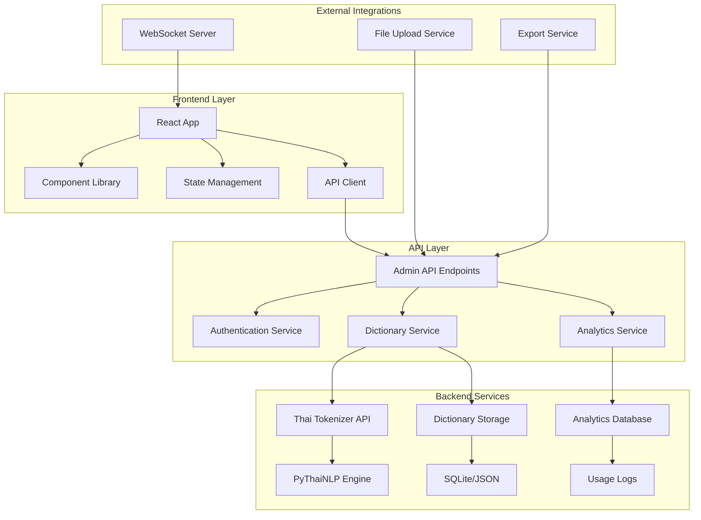

# Design Document

## Overview

The Thai Compound Word Admin Frontend is a modern, responsive web application that provides an intuitive interface for managing compound words in the tokenizer system. Built with React and TypeScript, the application features real-time tokenization testing, comprehensive analytics, bulk import/export capabilities, and seamless integration with the existing Thai tokenizer API.

The design emphasizes usability for non-technical users while providing advanced features for developers and system administrators. The system supports role-based access control, mobile responsiveness, and offline capabilities to ensure accessibility across different user contexts and environments.

## Architecture

### System Architecture



### Technology Stack

**Frontend:**
- Next.js 15 with TypeScript for full-stack React framework with SSR/SSG capabilities
- Tailwind CSS v4.x for utility-first styling with modern CSS features
- ShadCN/UI for high-quality, accessible component library built on Radix UI
- TanStack Query v5 for efficient API state management and caching
- React Hook Form for performant form handling with validation
- Recharts for interactive data visualization and analytics
- React Dropzone for drag-and-drop file upload functionality
- Framer Motion for smooth animations and transitions

**Backend Extensions:**
- FastAPI extensions for admin-specific endpoints
- SQLite for configuration storage and analytics data
- WebSocket support for real-time updates and notifications
- Pydantic v2 for robust data validation and serialization
- JWT authentication with role-based access control

## Components and Interfaces

### 1. Application Shell

```typescript
interface AppShellProps {
  user: UserInfo;
  systemHealth: SystemHealthStatus;
  notifications: Notification[];
}

interface UserInfo {
  id: string;
  username: string;
  email: string;
  role: UserRole;
  permissions: Permission[];
  lastLogin: Date;
}

enum UserRole {
  ADMIN = 'admin',
  EDITOR = 'editor',
  VIEWER = 'viewer'
}

enum Permission {
  VIEW_COMPOUNDS = 'view_compounds',
  EDIT_COMPOUNDS = 'edit_compounds',
  DELETE_COMPOUNDS = 'delete_compounds',
  BULK_OPERATIONS = 'bulk_operations',
  VIEW_ANALYTICS = 'view_analytics',
  SYSTEM_ADMIN = 'system_admin'
}
```

### 2. Dictionary Management Component

```typescript
interface DictionaryManagerProps {
  compounds: CompoundWord[];
  categories: Category[];
  filters: FilterOptions;
  onCompoundAdd: (word: CompoundWordInput) => Promise<CompoundWord>;
  onCompoundUpdate: (id: string, updates: Partial<CompoundWord>) => Promise<CompoundWord>;
  onCompoundDelete: (id: string) => Promise<void>;
  onBulkOperation: (operation: BulkOperation) => Promise<BulkResult>;
}

interface CompoundWord {
  id: string;
  word: string;
  category: string;
  components?: string[];
  confidence: number;
  usageCount: number;
  lastUsed?: Date;
  createdAt: Date;
  updatedAt: Date;
  createdBy: string;
  tags: string[];
  notes?: string;
}

interface FilterOptions {
  search: string;
  category: string;
  minUsageCount: number;
  dateRange: DateRange;
  sortBy: SortField;
  sortOrder: 'asc' | 'desc';
}
```

### 3. Real-time Testing Interface

```typescript
interface TestInterfaceProps {
  onTokenize: (text: string, options?: TokenizationOptions) => Promise<TokenizationResult>;
  compounds: CompoundWord[];
  testHistory: TestResult[];
}

interface TokenizationResult {
  originalText: string;
  tokens: TokenInfo[];
  wordBoundaries: number[];
  compoundsFound: CompoundMatch[];
  processingTime: number;
  engine: string;
  confidence: number;
  alternatives?: TokenizationResult[];
}

interface TokenInfo {
  text: string;
  startIndex: number;
  endIndex: number;
  isCompound: boolean;
  confidence: number;
  category?: string;
}

interface CompoundMatch {
  word: string;
  startIndex: number;
  endIndex: number;
  confidence: number;
  components?: string[];
}
```

### 4. Analytics Dashboard

```typescript
interface AnalyticsDashboardProps {
  usageMetrics: UsageMetrics;
  performanceMetrics: PerformanceMetrics;
  systemHealth: SystemHealthMetrics;
  dateRange: DateRange;
  refreshInterval: number;
}

interface UsageMetrics {
  totalRequests: number;
  uniqueTextsProcessed: number;
  compoundWordsUsed: CompoundUsageStats[];
  categoryDistribution: CategoryStats[];
  trendsOverTime: TimeSeriesData[];
  topPerformingCompounds: CompoundPerformance[];
}

interface PerformanceMetrics {
  averageResponseTime: number;
  p95ResponseTime: number;
  errorRate: number;
  throughput: number;
  memoryUsage: number;
  cpuUsage: number;
  cacheHitRate: number;
}

interface SystemHealthMetrics {
  apiStatus: ServiceStatus;
  databaseStatus: ServiceStatus;
  tokenizerInstances: TokenizerInstanceStatus[];
  lastDictionarySync: Date;
  activeUsers: number;
}
```

### 5. Import/Export Manager

```typescript
interface ImportExportProps {
  onImport: (file: File, options: ImportOptions) => Promise<ImportResult>;
  onExport: (options: ExportOptions) => Promise<Blob>;
  importHistory: ImportRecord[];
  supportedFormats: FileFormat[];
}

interface ImportOptions {
  format: FileFormat;
  skipDuplicates: boolean;
  validateOnly: boolean;
  categoryMapping?: Record<string, string>;
  defaultCategory?: string;
  overwriteExisting: boolean;
}

interface ImportResult {
  totalProcessed: number;
  successCount: number;
  errorCount: number;
  warningCount: number;
  errors: ImportError[];
  warnings: ImportWarning[];
  preview: CompoundWord[];
  summary: ImportSummary;
}

interface ExportOptions {
  format: FileFormat;
  categories?: string[];
  dateRange?: DateRange;
  includeMetadata: boolean;
  includeUsageStats: boolean;
  compression?: CompressionType;
}
```

## Data Models

### Frontend State Architecture

```typescript
// Global Application State
interface AppState {
  auth: AuthState;
  compounds: CompoundsState;
  analytics: AnalyticsState;
  ui: UIState;
  system: SystemState;
}

interface AuthState {
  user: UserInfo | null;
  token: string | null;
  permissions: Permission[];
  isAuthenticated: boolean;
  isLoading: boolean;
}

interface CompoundsState {
  items: CompoundWord[];
  categories: Category[];
  filters: FilterOptions;
  selectedItems: string[];
  editingItem: CompoundWord | null;
  isLoading: boolean;
  error: string | null;
  pagination: PaginationState;
}

interface AnalyticsState {
  usageMetrics: UsageMetrics | null;
  performanceMetrics: PerformanceMetrics | null;
  systemHealth: SystemHealthMetrics | null;
  isLoading: boolean;
  lastUpdated: Date | null;
  autoRefresh: boolean;
}
```

### API Data Transfer Objects

```typescript
// Request/Response DTOs
interface CompoundWordCreateRequest {
  word: string;
  category: string;
  components?: string[];
  confidence?: number;
  tags?: string[];
  notes?: string;
}

interface CompoundWordUpdateRequest {
  word?: string;
  category?: string;
  components?: string[];
  confidence?: number;
  tags?: string[];
  notes?: string;
}

interface TokenizationTestRequest {
  text: string;
  includeAlternatives?: boolean;
  engine?: string;
  preserveWhitespace?: boolean;
}

interface BulkOperationRequest {
  operation: 'delete' | 'update' | 'export';
  compoundIds: string[];
  updates?: Partial<CompoundWord>;
  exportOptions?: ExportOptions;
}
```

## User Interface Design

### Layout Structure

```
┌─────────────────────────────────────────────────────────────────┐
│ Header: Logo | Navigation | User Menu | Notifications | Health  │
├─────────────────────────────────────────────────────────────────┤
│ Sidebar:           │ Main Content Area:                         │
│ • Dashboard        │ ┌─────────────────────────────────────────┐ │
│ • Dictionary       │ │ Page Header with Actions                │ │
│ • Test Interface   │ ├─────────────────────────────────────────┤ │
│ • Analytics        │ │                                         │ │
│ • Import/Export    │ │ Dynamic Content Based on Route          │ │
│ • Settings         │ │                                         │ │
│ • Help             │ │                                         │ │
│                    │ └─────────────────────────────────────────┘ │
├─────────────────────────────────────────────────────────────────┤
│ Footer: Status | Last Updated | Version | Support Links         │
└─────────────────────────────────────────────────────────────────┘
```

### Responsive Design Breakpoints

```typescript
// Tailwind CSS breakpoints (mobile-first)
const breakpoints = {
  sm: '640px',   // Mobile landscape
  md: '768px',   // Tablet
  lg: '1024px',  // Desktop
  xl: '1280px',  // Large desktop
  '2xl': '1536px' // Extra large desktop
};

// Responsive behavior using Tailwind classes:
// Default (mobile): Collapsed sidebar, stacked layout
// md: Collapsible sidebar, adaptive layout  
// lg: Full sidebar, multi-column layout
// xl+: Enhanced spacing and larger content areas

// Example responsive component:
<div className="grid grid-cols-1 md:grid-cols-2 lg:grid-cols-3 xl:grid-cols-4 gap-4">
  {/* Cards adapt to screen size */}
</div>
```

### Theme and Styling

```typescript
// tailwind.config.ts
import type { Config } from 'tailwindcss'

const config: Config = {
  content: [
    './pages/**/*.{js,ts,jsx,tsx,mdx}',
    './components/**/*.{js,ts,jsx,tsx,mdx}',
    './app/**/*.{js,ts,jsx,tsx,mdx}',
  ],
  theme: {
    extend: {
      colors: {
        border: "hsl(var(--border))",
        input: "hsl(var(--input))",
        ring: "hsl(var(--ring))",
        background: "hsl(var(--background))",
        foreground: "hsl(var(--foreground))",
        primary: {
          DEFAULT: "hsl(var(--primary))",
          foreground: "hsl(var(--primary-foreground))",
        },
        secondary: {
          DEFAULT: "hsl(var(--secondary))",
          foreground: "hsl(var(--secondary-foreground))",
        },
        destructive: {
          DEFAULT: "hsl(var(--destructive))",
          foreground: "hsl(var(--destructive-foreground))",
        },
        muted: {
          DEFAULT: "hsl(var(--muted))",
          foreground: "hsl(var(--muted-foreground))",
        },
        accent: {
          DEFAULT: "hsl(var(--accent))",
          foreground: "hsl(var(--accent-foreground))",
        },
        popover: {
          DEFAULT: "hsl(var(--popover))",
          foreground: "hsl(var(--popover-foreground))",
        },
        card: {
          DEFAULT: "hsl(var(--card))",
          foreground: "hsl(var(--card-foreground))",
        },
      },
      fontFamily: {
        sans: ['Inter', 'Noto Sans Thai', 'sans-serif'],
        thai: ['Noto Sans Thai', 'sans-serif'],
      },
      borderRadius: {
        lg: "var(--radius)",
        md: "calc(var(--radius) - 2px)",
        sm: "calc(var(--radius) - 4px)",
      },
      keyframes: {
        "accordion-down": {
          from: { height: "0" },
          to: { height: "var(--radix-accordion-content-height)" },
        },
        "accordion-up": {
          from: { height: "var(--radix-accordion-content-height)" },
          to: { height: "0" },
        },
      },
      animation: {
        "accordion-down": "accordion-down 0.2s ease-out",
        "accordion-up": "accordion-up 0.2s ease-out",
      },
    },
  },
  plugins: [require("tailwindcss-animate")],
}

export default config

// CSS Variables for theming
:root {
  --background: 0 0% 100%;
  --foreground: 222.2 84% 4.9%;
  --card: 0 0% 100%;
  --card-foreground: 222.2 84% 4.9%;
  --popover: 0 0% 100%;
  --popover-foreground: 222.2 84% 4.9%;
  --primary: 221.2 83.2% 53.3%;
  --primary-foreground: 210 40% 98%;
  --secondary: 210 40% 96%;
  --secondary-foreground: 222.2 84% 4.9%;
  --muted: 210 40% 96%;
  --muted-foreground: 215.4 16.3% 46.9%;
  --accent: 210 40% 96%;
  --accent-foreground: 222.2 84% 4.9%;
  --destructive: 0 84.2% 60.2%;
  --destructive-foreground: 210 40% 98%;
  --border: 214.3 31.8% 91.4%;
  --input: 214.3 31.8% 91.4%;
  --ring: 221.2 83.2% 53.3%;
  --radius: 0.5rem;
}

.dark {
  --background: 222.2 84% 4.9%;
  --foreground: 210 40% 98%;
  --card: 222.2 84% 4.9%;
  --card-foreground: 210 40% 98%;
  --popover: 222.2 84% 4.9%;
  --popover-foreground: 210 40% 98%;
  --primary: 217.2 91.2% 59.8%;
  --primary-foreground: 222.2 84% 4.9%;
  --secondary: 217.2 32.6% 17.5%;
  --secondary-foreground: 210 40% 98%;
  --muted: 217.2 32.6% 17.5%;
  --muted-foreground: 215 20.2% 65.1%;
  --accent: 217.2 32.6% 17.5%;
  --accent-foreground: 210 40% 98%;
  --destructive: 0 62.8% 30.6%;
  --destructive-foreground: 210 40% 98%;
  --border: 217.2 32.6% 17.5%;
  --input: 217.2 32.6% 17.5%;
  --ring: 224.3 76.3% 94.1%;
}
```

## API Integration

### Admin API Endpoints

```python
# Dictionary Management
@router.get("/admin/compounds")
async def list_compounds(
    search: Optional[str] = None,
    category: Optional[str] = None,
    limit: int = Query(50, le=1000),
    offset: int = Query(0, ge=0),
    sort_by: str = "updated_at",
    sort_order: str = "desc"
) -> PaginatedResponse[CompoundWordResponse]

@router.post("/admin/compounds")
async def create_compound(
    compound: CompoundWordCreateRequest,
    current_user: User = Depends(get_current_user)
) -> CompoundWordResponse

@router.put("/admin/compounds/{compound_id}")
async def update_compound(
    compound_id: str,
    updates: CompoundWordUpdateRequest,
    current_user: User = Depends(get_current_user)
) -> CompoundWordResponse

@router.delete("/admin/compounds/{compound_id}")
async def delete_compound(
    compound_id: str,
    current_user: User = Depends(get_current_user)
) -> None

# Testing and Validation
@router.post("/admin/test/tokenize")
async def test_tokenization(
    request: TokenizationTestRequest
) -> TokenizationTestResponse

@router.post("/admin/test/batch")
async def batch_test_tokenization(
    requests: List[TokenizationTestRequest]
) -> List[TokenizationTestResponse]

# Analytics and Monitoring
@router.get("/admin/analytics/usage")
async def get_usage_analytics(
    start_date: datetime,
    end_date: datetime,
    granularity: str = "day"
) -> UsageAnalyticsResponse

@router.get("/admin/analytics/performance")
async def get_performance_metrics(
    start_date: datetime,
    end_date: datetime
) -> PerformanceMetricsResponse

@router.get("/admin/system/health")
async def get_system_health() -> SystemHealthResponse

# Import/Export Operations
@router.post("/admin/import")
async def import_compounds(
    file: UploadFile,
    options: ImportOptions = Depends(),
    current_user: User = Depends(get_current_user)
) -> ImportResultResponse

@router.post("/admin/export")
async def export_compounds(
    options: ExportOptions,
    current_user: User = Depends(get_current_user)
) -> StreamingResponse

# Bulk Operations
@router.post("/admin/bulk")
async def bulk_operation(
    operation: BulkOperationRequest,
    current_user: User = Depends(get_current_user)
) -> BulkOperationResponse
```

### WebSocket Integration

```python
# Real-time Updates
@app.websocket("/ws/admin")
async def websocket_endpoint(
    websocket: WebSocket,
    token: str = Query(...),
):
    user = await authenticate_websocket_user(token)
    await websocket.accept()
    
    try:
        while True:
            # Listen for dictionary changes
            # Broadcast real-time updates
            # Handle client messages
            pass
    except WebSocketDisconnect:
        # Cleanup connection
        pass
```

## Security and Authentication

### Authentication Flow

```typescript
interface AuthService {
  login(credentials: LoginCredentials): Promise<AuthResponse>;
  logout(): Promise<void>;
  refreshToken(): Promise<AuthResponse>;
  getCurrentUser(): Promise<UserInfo>;
  hasPermission(permission: Permission): boolean;
}

interface LoginCredentials {
  username: string;
  password: string;
  rememberMe?: boolean;
}

interface AuthResponse {
  accessToken: string;
  refreshToken: string;
  user: UserInfo;
  expiresIn: number;
}
```

### Role-Based Access Control

```typescript
const rolePermissions: Record<UserRole, Permission[]> = {
  [UserRole.ADMIN]: [
    Permission.VIEW_COMPOUNDS,
    Permission.EDIT_COMPOUNDS,
    Permission.DELETE_COMPOUNDS,
    Permission.BULK_OPERATIONS,
    Permission.VIEW_ANALYTICS,
    Permission.SYSTEM_ADMIN,
  ],
  [UserRole.EDITOR]: [
    Permission.VIEW_COMPOUNDS,
    Permission.EDIT_COMPOUNDS,
    Permission.BULK_OPERATIONS,
    Permission.VIEW_ANALYTICS,
  ],
  [UserRole.VIEWER]: [
    Permission.VIEW_COMPOUNDS,
    Permission.VIEW_ANALYTICS,
  ],
};

// Permission-based component rendering
const ProtectedComponent: React.FC<{
  permission: Permission;
  children: React.ReactNode;
}> = ({ permission, children }) => {
  const { hasPermission } = useAuth();
  return hasPermission(permission) ? <>{children}</> : null;
};
```

## Performance Optimization

### Frontend Performance

```typescript
// Code Splitting
const DictionaryManager = lazy(() => import('./pages/DictionaryManager'));
const Analytics = lazy(() => import('./pages/Analytics'));
const ImportExport = lazy(() => import('./pages/ImportExport'));

// Virtual Scrolling for Large Lists
const VirtualizedCompoundList: React.FC<{
  compounds: CompoundWord[];
  onItemClick: (compound: CompoundWord) => void;
}> = ({ compounds, onItemClick }) => {
  return (
    <FixedSizeList
      height={600}
      itemCount={compounds.length}
      itemSize={60}
      itemData={{ compounds, onItemClick }}
    >
      {CompoundListItem}
    </FixedSizeList>
  );
};

// Optimized Search with Debouncing
const useDebounceSearch = (searchTerm: string, delay: number = 300) => {
  const [debouncedTerm, setDebouncedTerm] = useState(searchTerm);
  
  useEffect(() => {
    const timer = setTimeout(() => setDebouncedTerm(searchTerm), delay);
    return () => clearTimeout(timer);
  }, [searchTerm, delay]);
  
  return debouncedTerm;
};
```

### Caching Strategy

```typescript
// React Query Configuration
const queryClient = new QueryClient({
  defaultOptions: {
    queries: {
      staleTime: 5 * 60 * 1000, // 5 minutes
      cacheTime: 10 * 60 * 1000, // 10 minutes
      refetchOnWindowFocus: false,
      retry: (failureCount, error) => {
        if (error.status === 404) return false;
        return failureCount < 3;
      },
    },
    mutations: {
      onError: (error) => {
        toast.error(`Operation failed: ${error.message}`);
      },
    },
  },
});

// Smart Cache Invalidation
const useCompoundMutations = () => {
  const queryClient = useQueryClient();
  
  const createMutation = useMutation({
    mutationFn: createCompound,
    onSuccess: (newCompound) => {
      // Update compounds list cache
      queryClient.setQueryData(['compounds'], (old: CompoundWord[]) => 
        [...(old || []), newCompound]
      );
      // Invalidate analytics cache
      queryClient.invalidateQueries(['analytics']);
    },
  });
  
  return { createMutation };
};
```

## Testing Strategy

### Component Testing

```typescript
// Example test for DictionaryManager
describe('DictionaryManager', () => {
  const mockCompounds: CompoundWord[] = [
    {
      id: '1',
      word: 'วากาเมะ',
      category: 'thai_japanese_compounds',
      confidence: 0.95,
      usageCount: 1247,
      createdAt: new Date('2024-01-15'),
      updatedAt: new Date('2024-01-15'),
      createdBy: 'admin',
      tags: ['food', 'japanese'],
    },
  ];

  it('should display compound words in table', async () => {
    render(
      <QueryClientProvider client={testQueryClient}>
        <DictionaryManager />
      </QueryClientProvider>
    );

    await waitFor(() => {
      expect(screen.getByText('วากาเมะ')).toBeInTheDocument();
      expect(screen.getByText('1,247')).toBeInTheDocument();
    });
  });

  it('should filter compounds by search term', async () => {
    const user = userEvent.setup();
    render(<DictionaryManager />);

    const searchInput = screen.getByPlaceholderText('Search compound words...');
    await user.type(searchInput, 'วากา');

    await waitFor(() => {
      expect(screen.getByText('วากาเมะ')).toBeInTheDocument();
      expect(screen.queryByText('ซาชิมิ')).not.toBeInTheDocument();
    });
  });
});
```

### Integration Testing

```typescript
// API Integration Tests
describe('Admin API Integration', () => {
  it('should create compound word via API', async () => {
    const newCompound: CompoundWordCreateRequest = {
      word: 'เทมปุระ',
      category: 'thai_japanese_compounds',
      confidence: 0.98,
      tags: ['food', 'japanese'],
    };

    const response = await adminAPI.createCompound(newCompound);
    
    expect(response.word).toBe('เทมปุระ');
    expect(response.id).toBeDefined();
    expect(response.createdAt).toBeDefined();
  });

  it('should handle API errors gracefully', async () => {
    const invalidCompound = { word: '', category: '' };
    
    await expect(adminAPI.createCompound(invalidCompound))
      .rejects.toThrow('Validation error');
  });
});
```

## Deployment and Infrastructure

### Docker Configuration

```dockerfile
# Multi-stage build for production
FROM node:18-alpine AS frontend-build
WORKDIR /app/frontend
COPY frontend/package*.json ./
RUN npm ci --only=production
COPY frontend/ ./
RUN npm run build

FROM python:3.11-slim AS backend
WORKDIR /app
COPY requirements.txt ./
RUN pip install --no-cache-dir -r requirements.txt
COPY backend/ ./
COPY --from=frontend-build /app/frontend/dist ./static

# Health check
HEALTHCHECK --interval=30s --timeout=10s --start-period=5s --retries=3 \
  CMD curl -f http://localhost:8080/health || exit 1

EXPOSE 8080
CMD ["uvicorn", "main:app", "--host", "0.0.0.0", "--port", "8080"]
```

### Environment Configuration

```yaml
# docker-compose.yml
version: '3.8'
services:
  thai-tokenizer-admin:
    build: .
    ports:
      - "8080:8080"
    environment:
      - DATABASE_URL=sqlite:///./admin.db
      - JWT_SECRET=${JWT_SECRET}
      - CORS_ORIGINS=http://localhost:3000,https://admin.yourdomain.com
      - LOG_LEVEL=INFO
    volumes:
      - ./data:/app/data
      - ./logs:/app/logs
    depends_on:
      - redis
    restart: unless-stopped

  redis:
    image: redis:7-alpine
    ports:
      - "6379:6379"
    volumes:
      - redis_data:/data
    restart: unless-stopped

volumes:
  redis_data:
```

## Monitoring and Observability

### Application Metrics

```typescript
// Frontend Performance Monitoring
const usePerformanceMonitoring = () => {
  useEffect(() => {
    // Track page load times
    const observer = new PerformanceObserver((list) => {
      list.getEntries().forEach((entry) => {
        if (entry.entryType === 'navigation') {
          analytics.track('page_load_time', {
            duration: entry.duration,
            page: window.location.pathname,
          });
        }
      });
    });
    
    observer.observe({ entryTypes: ['navigation'] });
    return () => observer.disconnect();
  }, []);
};

// Error Boundary with Reporting
class ErrorBoundary extends React.Component {
  componentDidCatch(error: Error, errorInfo: ErrorInfo) {
    console.error('Frontend error:', error, errorInfo);
    
    // Report to monitoring service
    errorReporting.captureException(error, {
      extra: errorInfo,
      tags: {
        component: 'admin-frontend',
        version: process.env.REACT_APP_VERSION,
      },
    });
  }
}
```

### Backend Monitoring

```python
# API Performance Monitoring
@app.middleware("http")
async def monitor_requests(request: Request, call_next):
    start_time = time.time()
    
    response = await call_next(request)
    
    process_time = time.time() - start_time
    
    # Log metrics
    logger.info(
        "API request completed",
        extra={
            "method": request.method,
            "url": str(request.url),
            "status_code": response.status_code,
            "process_time": process_time,
            "user_id": getattr(request.state, "user_id", None),
        }
    )
    
    # Track in metrics system
    metrics.histogram("api_request_duration", process_time, {
        "method": request.method,
        "endpoint": request.url.path,
        "status": response.status_code,
    })
    
    return response
```