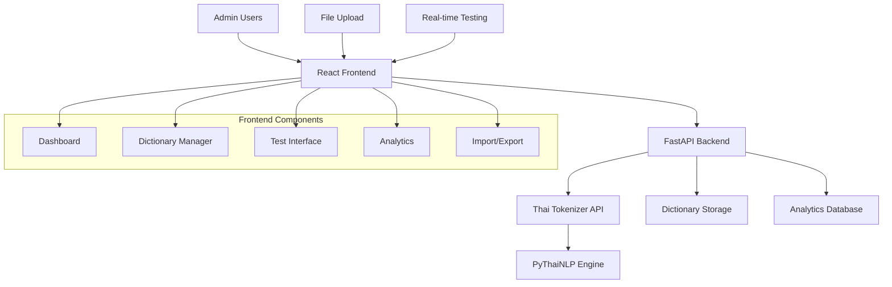

# Design Document

## Overview

The Compound Word Admin Frontend is a modern web application built with React and TypeScript that provides an intuitive interface for managing Thai compound words. The system features real-time tokenization testing, bulk import/export capabilities, usage analytics, and seamless integration with the existing Thai tokenizer API. The design emphasizes usability for non-technical users while providing advanced features for developers and linguists.

## Architecture

### System Architecture



### Technology Stack

**Frontend:**
- React 18 with TypeScript
- Material-UI (MUI) for components
- React Query for API state management
- React Hook Form for form handling
- Recharts for analytics visualization

**Backend:**
- FastAPI for admin API endpoints
- SQLite for configuration and analytics
- WebSocket for real-time updates
- Pydantic for data validation

## Components and Interfaces

### 1. Dashboard Component

```typescript
interface DashboardProps {
  compoundStats: CompoundWordStats;
  recentActivity: ActivityLog[];
  systemHealth: HealthStatus;
}

interface CompoundWordStats {
  totalWords: number;
  categoryCounts: Record<string, number>;
  recentlyAdded: number;
  usageFrequency: Record<string, number>;
}
```

**Features:**
- Overview cards showing total compounds, categories, recent additions
- Real-time system health indicators
- Quick access to most-used compound words
- Recent activity feed

### 2. Dictionary Manager Component

```typescript
interface DictionaryManagerProps {
  compounds: CompoundWord[];
  categories: string[];
  onAdd: (word: CompoundWord) => Promise<void>;
  onEdit: (id: string, word: CompoundWord) => Promise<void>;
  onDelete: (id: string) => Promise<void>;
}

interface CompoundWord {
  id: string;
  word: string;
  category: string;
  components?: string[];
  confidence: number;
  createdAt: Date;
  updatedAt: Date;
  usageCount: number;
}
```

**Features:**
- Searchable and filterable compound word table
- Inline editing with validation
- Category-based organization
- Bulk selection and operations
- Usage statistics per word

### 3. Real-time Test Interface

```typescript
interface TestInterfaceProps {
  onTest: (text: string) => Promise<TokenizationResult>;
  compounds: CompoundWord[];
}

interface TokenizationResult {
  originalText: string;
  tokens: string[];
  wordBoundaries: number[];
  compoundsFound: string[];
  processingTime: number;
  engine: string;
}
```

**Features:**
- Live text input with instant tokenization
- Visual highlighting of compound words
- Before/after comparison mode
- Performance metrics display
- Sample text templates

### 4. Analytics Dashboard

```typescript
interface AnalyticsProps {
  usageData: UsageMetrics[];
  performanceData: PerformanceMetrics[];
  errorLogs: ErrorLog[];
  dateRange: DateRange;
}

interface UsageMetrics {
  date: Date;
  totalRequests: number;
  compoundWordsUsed: Record<string, number>;
  averageResponseTime: number;
}
```

**Features:**
- Usage trends over time
- Most/least used compound words
- Performance metrics and alerts
- Error rate monitoring
- Exportable reports

### 5. Import/Export Manager

```typescript
interface ImportExportProps {
  onImport: (file: File, format: ImportFormat) => Promise<ImportResult>;
  onExport: (format: ExportFormat, filters?: ExportFilters) => Promise<Blob>;
}

interface ImportResult {
  totalProcessed: number;
  successCount: number;
  errorCount: number;
  errors: ImportError[];
  preview: CompoundWord[];
}
```

**Features:**
- Drag-and-drop file upload
- Format validation and preview
- Error reporting and correction
- Multiple export formats
- Backup and restore functionality

## Data Models

### Frontend State Management

```typescript
// Global State (React Query)
interface AppState {
  compounds: CompoundWord[];
  categories: string[];
  analytics: AnalyticsData;
  systemHealth: HealthStatus;
  user: UserInfo;
}

// Local Component State
interface DictionaryState {
  selectedWords: string[];
  filters: FilterOptions;
  sortOrder: SortOptions;
  editingWord: CompoundWord | null;
}
```

### API Integration

```typescript
// API Client
class CompoundAdminAPI {
  async getCompounds(filters?: FilterOptions): Promise<CompoundWord[]>;
  async addCompound(word: CompoundWord): Promise<CompoundWord>;
  async updateCompound(id: string, word: Partial<CompoundWord>): Promise<CompoundWord>;
  async deleteCompound(id: string): Promise<void>;
  async testTokenization(text: string): Promise<TokenizationResult>;
  async getAnalytics(dateRange: DateRange): Promise<AnalyticsData>;
  async importCompounds(file: File): Promise<ImportResult>;
  async exportCompounds(format: ExportFormat): Promise<Blob>;
}
```

## User Interface Design

### Layout Structure

```
┌─────────────────────────────────────────────────────────┐
│ Header: Thai Tokenizer Admin | User Menu | Health Status │
├─────────────────────────────────────────────────────────┤
│ Sidebar Navigation:                                     │
│ • Dashboard                                             │
│ • Dictionary Manager                                    │
│ • Test Interface                                        │
│ • Analytics                                             │
│ • Import/Export                                         │
│ • Settings                                              │
├─────────────────────────────────────────────────────────┤
│ Main Content Area:                                      │
│ [Dynamic content based on selected navigation]         │
├─────────────────────────────────────────────────────────┤
│ Footer: Status Bar | Last Updated | Version Info       │
└─────────────────────────────────────────────────────────┘
```

### Key UI Features

1. **Responsive Design**: Mobile-friendly interface
2. **Dark/Light Theme**: User preference support
3. **Real-time Updates**: WebSocket integration for live data
4. **Accessibility**: WCAG 2.1 AA compliance
5. **Internationalization**: Thai and English language support

## API Endpoints

### Dictionary Management

```python
# New admin endpoints to add to existing API
@router.get("/admin/compounds")
async def get_compounds(
    category: Optional[str] = None,
    search: Optional[str] = None,
    limit: int = 100,
    offset: int = 0
) -> List[CompoundWordResponse]

@router.post("/admin/compounds")
async def create_compound(
    compound: CompoundWordRequest
) -> CompoundWordResponse

@router.put("/admin/compounds/{compound_id}")
async def update_compound(
    compound_id: str,
    compound: CompoundWordRequest
) -> CompoundWordResponse

@router.delete("/admin/compounds/{compound_id}")
async def delete_compound(compound_id: str) -> None

@router.post("/admin/compounds/test")
async def test_tokenization(
    request: TokenizationTestRequest
) -> TokenizationTestResponse
```

### Analytics and Monitoring

```python
@router.get("/admin/analytics/usage")
async def get_usage_analytics(
    start_date: datetime,
    end_date: datetime
) -> UsageAnalyticsResponse

@router.get("/admin/analytics/performance")
async def get_performance_metrics(
    start_date: datetime,
    end_date: datetime
) -> PerformanceMetricsResponse

@router.get("/admin/system/health")
async def get_system_health() -> SystemHealthResponse
```

### Import/Export

```python
@router.post("/admin/compounds/import")
async def import_compounds(
    file: UploadFile,
    format: ImportFormat = ImportFormat.JSON
) -> ImportResultResponse

@router.get("/admin/compounds/export")
async def export_compounds(
    format: ExportFormat = ExportFormat.JSON,
    category: Optional[str] = None
) -> StreamingResponse
```

## Security and Authentication

### Authentication Strategy

1. **JWT-based Authentication**: Secure token-based auth
2. **Role-based Access Control**: Admin, Editor, Viewer roles
3. **API Key Management**: For programmatic access
4. **Session Management**: Secure session handling

### Security Features

```typescript
interface UserRole {
  id: string;
  name: string;
  permissions: Permission[];
}

enum Permission {
  VIEW_COMPOUNDS = "view_compounds",
  EDIT_COMPOUNDS = "edit_compounds",
  DELETE_COMPOUNDS = "delete_compounds",
  IMPORT_EXPORT = "import_export",
  VIEW_ANALYTICS = "view_analytics",
  SYSTEM_ADMIN = "system_admin"
}
```

## Performance Considerations

### Frontend Optimization

1. **Code Splitting**: Lazy load components
2. **Virtual Scrolling**: Handle large compound lists
3. **Debounced Search**: Optimize API calls
4. **Caching Strategy**: React Query for smart caching
5. **Bundle Optimization**: Tree shaking and minification

### Backend Optimization

1. **Database Indexing**: Optimize compound word queries
2. **Caching Layer**: Redis for frequently accessed data
3. **Pagination**: Efficient data loading
4. **WebSocket Optimization**: Selective real-time updates
5. **API Rate Limiting**: Prevent abuse

## Deployment Strategy

### Development Setup

```bash
# Frontend development
cd frontend
npm install
npm run dev

# Backend development
cd backend
pip install -r requirements.txt
uvicorn main:app --reload
```

### Production Deployment

```dockerfile
# Multi-stage Docker build
FROM node:18-alpine AS frontend-build
WORKDIR /app/frontend
COPY frontend/package*.json ./
RUN npm ci --only=production
COPY frontend/ ./
RUN npm run build

FROM python:3.11-slim AS backend
WORKDIR /app
COPY requirements.txt ./
RUN pip install -r requirements.txt
COPY backend/ ./
COPY --from=frontend-build /app/frontend/dist ./static

EXPOSE 8080
CMD ["uvicorn", "main:app", "--host", "0.0.0.0", "--port", "8080"]
```

## Testing Strategy

### Frontend Testing

1. **Unit Tests**: Jest + React Testing Library
2. **Integration Tests**: API integration testing
3. **E2E Tests**: Playwright for user workflows
4. **Visual Regression**: Chromatic for UI consistency

### Backend Testing

1. **API Tests**: FastAPI test client
2. **Database Tests**: SQLite in-memory testing
3. **Integration Tests**: Full tokenizer integration
4. **Performance Tests**: Load testing with locust

## Future Enhancements

1. **Machine Learning Integration**: Auto-suggest compound words
2. **Advanced Analytics**: Predictive usage patterns
3. **Multi-language Support**: Extend beyond Thai compounds
4. **API Versioning**: Support multiple tokenizer versions
5. **Audit Logging**: Detailed change tracking
6. **Backup Automation**: Scheduled dictionary backups