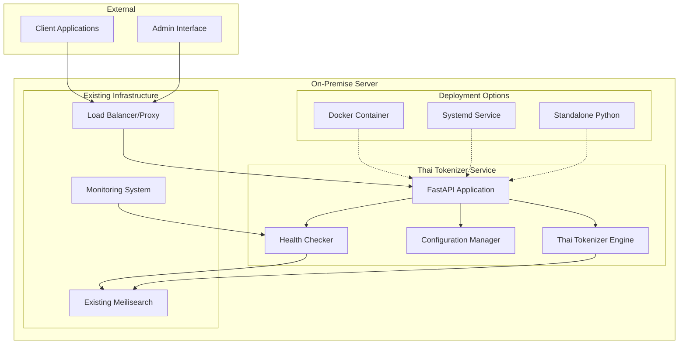
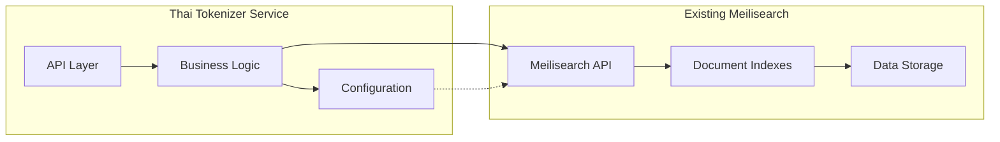

# Design Document

## Overview

The on-premise deployment design provides a comprehensive solution for deploying the Thai Tokenizer service to integrate with existing Meilisearch infrastructure. The design emphasizes flexibility, security, and operational simplicity while maintaining high performance for Thai text processing.

The solution supports three deployment methods (Docker, systemd service, and standalone Python) to accommodate different infrastructure preferences and operational requirements. Each method provides the same API functionality while optimizing for specific deployment scenarios.

## Architecture

### High-Level Architecture



### Service Integration Architecture



## Components and Interfaces

### 1. Deployment Manager Component

**Purpose**: Orchestrates the deployment process across different deployment methods.

**Key Classes**:
- `DeploymentManager`: Main orchestration class
- `DockerDeployment`: Docker-specific deployment logic
- `SystemdDeployment`: Systemd service deployment logic
- `StandaloneDeployment`: Python virtual environment deployment

**Interfaces**:
```python
class DeploymentInterface:
    def validate_requirements(self) -> ValidationResult
    def install_dependencies(self) -> InstallResult
    def configure_service(self, config: DeploymentConfig) -> ConfigResult
    def start_service(self) -> ServiceResult
    def verify_deployment(self) -> VerificationResult
```

### 2. Configuration Management Component

**Purpose**: Manages configuration for on-premise deployment with existing Meilisearch integration.

**Key Features**:
- Environment-specific configuration templates
- Secure credential management
- Meilisearch connection validation
- Runtime configuration updates

**Configuration Structure**:
```python
class OnPremiseConfig(BaseModel):
    # Existing Meilisearch connection
    meilisearch_host: str
    meilisearch_api_key: str
    meilisearch_ssl_enabled: bool = False
    
    # Service configuration
    service_port: int = 8000
    service_host: str = "0.0.0.0"
    worker_processes: int = 4
    
    # Security settings
    allowed_hosts: List[str]
    cors_origins: List[str]
    api_key_required: bool = False
    
    # Performance settings
    max_concurrent_requests: int = 100
    request_timeout_seconds: int = 30
    memory_limit_mb: int = 512
```

### 3. Health Check and Monitoring Component

**Purpose**: Provides comprehensive health checking and monitoring for on-premise deployment.

**Health Check Categories**:
- Service health (API responsiveness)
- Meilisearch connectivity
- Resource utilization
- Thai tokenization functionality

**Monitoring Endpoints**:
- `/health` - Basic health status
- `/health/detailed` - Comprehensive health report
- `/metrics` - Prometheus-compatible metrics
- `/status` - Service status and configuration

### 4. Security Component

**Purpose**: Implements security measures for on-premise deployment.

**Security Features**:
- TLS/SSL support for Meilisearch connections
- API key authentication (optional)
- Network access control
- Secure configuration file handling
- Audit logging

### 5. Backup and Recovery Component

**Purpose**: Provides backup and recovery capabilities for service configuration and custom dictionaries.

**Backup Components**:
- Configuration files backup
- Custom dictionary backup
- Service state backup
- Automated backup scheduling

## Data Models

### Deployment Configuration Model

```python
class DeploymentConfig(BaseModel):
    # Deployment method
    deployment_method: Literal["docker", "systemd", "standalone"]
    
    # Service configuration
    service_name: str = "thai-tokenizer"
    service_port: int = 8000
    service_user: str = "thai-tokenizer"
    
    # Meilisearch integration
    meilisearch_config: MeilisearchConnectionConfig
    
    # Resource limits
    memory_limit_mb: int = 512
    cpu_limit_cores: float = 1.0
    
    # Security settings
    security_config: SecurityConfig
    
    # Monitoring settings
    monitoring_config: MonitoringConfig
```

### Meilisearch Connection Model

```python
class MeilisearchConnectionConfig(BaseModel):
    host: str
    port: int = 7700
    api_key: str
    ssl_enabled: bool = False
    ssl_verify: bool = True
    timeout_seconds: int = 30
    max_retries: int = 3
    
    # Connection validation
    def validate_connection(self) -> ConnectionResult:
        # Implementation for testing connection
        pass
```

### Deployment Result Model

```python
class DeploymentResult(BaseModel):
    success: bool
    deployment_method: str
    service_status: ServiceStatus
    configuration_path: str
    log_file_path: str
    errors: List[str] = []
    warnings: List[str] = []
    
    # Service endpoints
    api_url: str
    health_url: str
    metrics_url: str
```

## Error Handling

### Error Categories

1. **Pre-deployment Errors**:
   - System requirements not met
   - Existing Meilisearch not accessible
   - Insufficient permissions
   - Port conflicts

2. **Deployment Errors**:
   - Service installation failures
   - Configuration errors
   - Dependency installation issues
   - Service startup failures

3. **Runtime Errors**:
   - Meilisearch connection failures
   - Thai tokenization errors
   - Resource exhaustion
   - Authentication failures

### Error Recovery Strategies

```python
class ErrorRecoveryManager:
    def handle_meilisearch_connection_error(self, error: ConnectionError):
        # Implement retry logic with exponential backoff
        # Fall back to offline mode if configured
        # Alert administrators
        pass
    
    def handle_service_startup_error(self, error: StartupError):
        # Check configuration validity
        # Verify dependencies
        # Attempt service restart
        # Rollback to previous version if needed
        pass
    
    def handle_resource_exhaustion(self, error: ResourceError):
        # Implement graceful degradation
        # Reduce concurrent processing
        # Clear caches
        # Alert monitoring systems
        pass
```

## Testing Strategy

### 1. Pre-deployment Testing

**System Requirements Validation**:
- Operating system compatibility
- Python version verification
- Available ports check
- Disk space validation
- Memory requirements check

**Meilisearch Integration Testing**:
- Connection validation
- API key verification
- Index access testing
- Performance baseline testing

### 2. Deployment Testing

**Installation Testing**:
- Clean installation on fresh system
- Upgrade from previous versions
- Configuration migration testing
- Service startup verification

**Integration Testing**:
- End-to-end Thai tokenization workflow
- Meilisearch document processing
- API endpoint functionality
- Health check validation

### 3. Post-deployment Testing

**Performance Testing**:
- Thai tokenization performance benchmarks
- Concurrent request handling
- Memory usage monitoring
- Response time validation

**Security Testing**:
- Authentication mechanism testing
- Network access control validation
- SSL/TLS connection testing
- Configuration security audit

### 4. Automated Testing Framework

```python
class DeploymentTestSuite:
    def test_system_requirements(self) -> TestResult:
        # Validate system compatibility
        pass
    
    def test_meilisearch_connectivity(self, config: MeilisearchConfig) -> TestResult:
        # Test connection to existing Meilisearch
        pass
    
    def test_thai_tokenization(self) -> TestResult:
        # Validate Thai text processing
        pass
    
    def test_performance_benchmarks(self) -> TestResult:
        # Run performance tests
        pass
    
    def generate_test_report(self) -> TestReport:
        # Generate comprehensive test report
        pass
```

## Deployment Methods

### 1. Docker Deployment

**Advantages**:
- Isolated environment
- Easy scaling and management
- Consistent deployment across environments
- Built-in health checks

**Configuration**:
- Custom Docker Compose for external Meilisearch
- Environment variable configuration
- Volume mounts for persistent data
- Network configuration for Meilisearch access

### 2. Systemd Service Deployment

**Advantages**:
- Native Linux service integration
- Automatic startup and restart
- System logging integration
- Resource management via systemd

**Configuration**:
- Service unit file creation
- User and group management
- Log rotation configuration
- Service dependencies

### 3. Standalone Python Deployment

**Advantages**:
- Direct Python environment control
- Minimal overhead
- Easy debugging and development
- Custom Python version support

**Configuration**:
- Virtual environment setup
- Dependency installation
- Process management scripts
- Manual service management

## Security Considerations

### 1. Network Security

- Firewall configuration for service ports
- TLS/SSL encryption for Meilisearch connections
- Network segmentation recommendations
- VPN access for remote administration

### 2. Authentication and Authorization

- Optional API key authentication
- Integration with existing authentication systems
- Role-based access control for admin functions
- Audit logging for security events

### 3. Data Protection

- Secure storage of configuration files
- Encryption of sensitive configuration data
- Secure handling of Meilisearch API keys
- Data privacy compliance for Thai text processing

### 4. System Security

- Non-root user execution
- File permission management
- System resource limits
- Security update procedures

## Performance Optimization

### 1. Resource Management

- Memory usage optimization for Thai tokenization
- CPU utilization balancing
- Disk I/O optimization for logging
- Network connection pooling

### 2. Caching Strategy

- Thai tokenization result caching
- Configuration caching
- Connection pooling for Meilisearch
- Response caching for frequent requests

### 3. Monitoring and Alerting

- Performance metrics collection
- Resource usage monitoring
- Error rate tracking
- Automated alerting for issues

## Maintenance and Operations

### 1. Backup Procedures

- Configuration backup automation
- Custom dictionary backup
- Service state backup
- Recovery testing procedures

### 2. Update Management

- Service update procedures
- Configuration migration
- Rollback procedures
- Zero-downtime update strategies

### 3. Troubleshooting

- Common issue resolution guides
- Log analysis procedures
- Performance troubleshooting
- Meilisearch integration debugging