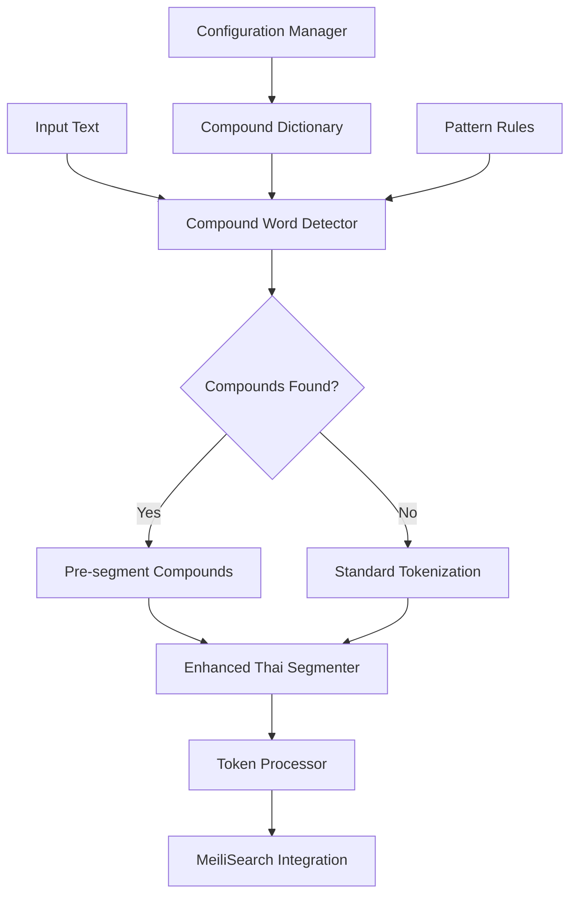

# Design Document

## Overview

This design addresses the critical compound word tokenization issue where Thai-Japanese terms like "วากาเมะ" (wakame) are incorrectly split into individual syllables ["วา", "กา", "เมะ"] instead of being recognized as single semantic units. The current PyThaiNLP-based tokenizer lacks compound word recognition capabilities, leading to poor search accuracy in MeiliSearch.

The solution involves implementing a multi-layered compound word recognition system that combines dictionary-based lookup, pattern matching, and contextual analysis to identify and preserve compound words during tokenization.

## Architecture

### Core Components

1. **Compound Word Dictionary Manager**
   - Manages configurable compound word dictionaries
   - Supports hot-reloading of dictionary updates
   - Provides compound word validation and scoring

2. **Enhanced Thai Segmenter**
   - Extends existing `ThaiSegmenter` with compound word recognition
   - Implements pre-processing compound detection
   - Maintains backward compatibility with current tokenization

3. **Compound Word Detector**
   - Pattern-based compound word identification
   - Context-aware compound boundary detection
   - Confidence scoring for compound word candidates

4. **Tokenization Pipeline**
   - Multi-pass tokenization with compound word preservation
   - Fallback mechanisms for unknown compounds
   - Performance optimization for real-time processing

### System Integration



## Components and Interfaces

### 1. Compound Word Dictionary Manager

```python
class CompoundWordDictionary:
    """Manages compound word dictionaries with validation and scoring."""
    
    def __init__(self, dictionary_path: str, auto_reload: bool = True)
    def load_dictionary(self) -> Dict[str, CompoundWordEntry]
    def add_compound_word(self, word: str, components: List[str], confidence: float)
    def remove_compound_word(self, word: str)
    def find_compounds_in_text(self, text: str) -> List[CompoundMatch]
    def validate_compound(self, word: str, components: List[str]) -> bool
    def get_compound_score(self, word: str) -> float
```

### 2. Enhanced Thai Segmenter

```python
class EnhancedThaiSegmenter(ThaiSegmenter):
    """Extended segmenter with compound word recognition."""
    
    def __init__(self, compound_dictionary: CompoundWordDictionary, **kwargs)
    def segment_with_compounds(self, text: str) -> TokenizationResult
    def detect_compound_boundaries(self, text: str) -> List[CompoundBoundary]
    def preserve_compound_integrity(self, tokens: List[str], compounds: List[CompoundMatch]) -> List[str]
```

### 3. Compound Word Detector

```python
class CompoundWordDetector:
    """Detects compound words using multiple strategies."""
    
    def __init__(self, dictionary: CompoundWordDictionary, pattern_rules: List[PatternRule])
    def detect_compounds(self, text: str) -> List[CompoundCandidate]
    def apply_pattern_rules(self, text: str) -> List[PatternMatch]
    def score_compound_candidate(self, candidate: CompoundCandidate) -> float
    def validate_compound_context(self, compound: str, context: str) -> bool
```

## Data Models

### Compound Word Entry

```python
@dataclass
class CompoundWordEntry:
    """Dictionary entry for compound words."""
    
    compound: str  # Full compound word (e.g., "วากาเมะ")
    components: List[str]  # Component parts (e.g., ["วา", "กา", "เมะ"])
    category: str  # Category (e.g., "food", "brand", "technical")
    confidence: float  # Confidence score (0.0-1.0)
    language_origin: str  # Origin language (e.g., "japanese", "english")
    usage_frequency: int  # Usage frequency for prioritization
    created_at: datetime
    updated_at: datetime
```

### Compound Match

```python
@dataclass
class CompoundMatch:
    """Represents a detected compound word in text."""
    
    compound: str  # The compound word found
    start_pos: int  # Start position in original text
    end_pos: int  # End position in original text
    confidence: float  # Detection confidence
    source: str  # Detection source ("dictionary", "pattern", "context")
    components: List[str]  # Individual components if known
    preserve_as_single: bool  # Whether to keep as single token
```

### Pattern Rule

```python
@dataclass
class PatternRule:
    """Pattern-based compound detection rule."""
    
    name: str  # Rule name
    pattern: str  # Regex pattern
    category: str  # Compound category
    confidence: float  # Base confidence for matches
    min_length: int  # Minimum compound length
    max_length: int  # Maximum compound length
    context_required: bool  # Whether context validation is needed
```

## Error Handling

### Graceful Degradation Strategy

1. **Dictionary Loading Failures**
   - Log warning and continue with empty dictionary
   - Provide fallback to pattern-based detection only
   - Maintain service availability

2. **Compound Detection Failures**
   - Fall back to standard tokenization
   - Log detection failures for analysis
   - Preserve original tokenization behavior

3. **Performance Degradation**
   - Implement timeout mechanisms for compound detection
   - Provide fast-path for simple text without compounds
   - Monitor and alert on performance issues

### Error Recovery

```python
class CompoundWordError(Exception):
    """Base exception for compound word processing."""
    pass

class DictionaryLoadError(CompoundWordError):
    """Dictionary loading failed."""
    pass

class CompoundDetectionError(CompoundWordError):
    """Compound detection failed."""
    pass
```

## Testing Strategy

### Unit Testing

1. **Dictionary Management Tests**
   - Dictionary loading and validation
   - Compound word CRUD operations
   - Hot-reload functionality
   - Error handling scenarios

2. **Compound Detection Tests**
   - Pattern matching accuracy
   - Context validation
   - Confidence scoring
   - Performance benchmarks

3. **Integration Tests**
   - End-to-end tokenization with compounds
   - MeiliSearch integration
   - Fallback mechanism validation
   - Mixed content handling

### Test Data Sets

1. **Thai-Japanese Compound Words**
   - Food terms: "วากาเมะ", "ซาชิมิ", "เทมปุระ"
   - Brand names: "โตโยต้า", "ฮอนด้า", "นิสสัน"
   - Technical terms: "คาราโอเกะ", "คาราเต้"

2. **Thai-English Compound Words**
   - Technology: "คอมพิวเตอร์", "อินเทอร์เน็ต"
   - Business: "มาร์เก็ตติ้ง", "แบรนด์ดิ้ง"

3. **Complex Contexts**
   - Compound words in sentences
   - Multiple compounds in single text
   - Mixed Thai-foreign content

### Performance Testing

1. **Tokenization Speed**
   - Target: <50ms for 1000 characters with compound detection
   - Benchmark against current implementation
   - Memory usage monitoring

2. **Dictionary Size Impact**
   - Test with dictionaries of varying sizes (100, 1000, 10000 entries)
   - Measure lookup performance
   - Memory consumption analysis

3. **Concurrent Processing**
   - Multi-threaded tokenization testing
   - Resource contention analysis
   - Throughput measurement

## Implementation Phases

### Phase 1: Core Infrastructure
- Implement `CompoundWordDictionary` class
- Create basic compound word data models
- Set up configuration management for compound words
- Add dictionary loading and validation

### Phase 2: Detection Engine
- Implement `CompoundWordDetector` with pattern matching
- Add dictionary-based compound lookup
- Create confidence scoring system
- Implement context validation

### Phase 3: Segmenter Integration
- Extend `ThaiSegmenter` with compound word support
- Implement compound-aware tokenization pipeline
- Add fallback mechanisms
- Integrate with existing token processing

### Phase 4: MeiliSearch Integration
- Update token processor for compound word handling
- Modify MeiliSearch settings for compound tokens
- Implement search optimization for compounds
- Add compound-aware query processing

### Phase 5: Configuration and Management
- Implement hot-reload for dictionary updates
- Add REST API endpoints for dictionary management
- Create monitoring and metrics for compound detection
- Add performance optimization features

## Performance Considerations

### Optimization Strategies

1. **Dictionary Indexing**
   - Use trie data structure for efficient prefix matching
   - Implement LRU cache for frequently accessed compounds
   - Pre-compile regex patterns for pattern rules

2. **Processing Pipeline**
   - Early exit for text without potential compounds
   - Parallel processing for independent text segments
   - Batch processing for multiple documents

3. **Memory Management**
   - Lazy loading of large dictionaries
   - Memory-mapped dictionary files for large datasets
   - Garbage collection optimization for token objects

### Monitoring and Metrics

1. **Performance Metrics**
   - Tokenization time with/without compound detection
   - Dictionary lookup performance
   - Memory usage patterns
   - Cache hit rates

2. **Accuracy Metrics**
   - Compound detection precision and recall
   - False positive rates for compound identification
   - Search relevance improvement measurements

3. **Operational Metrics**
   - Dictionary reload frequency
   - Error rates and types
   - System resource utilization