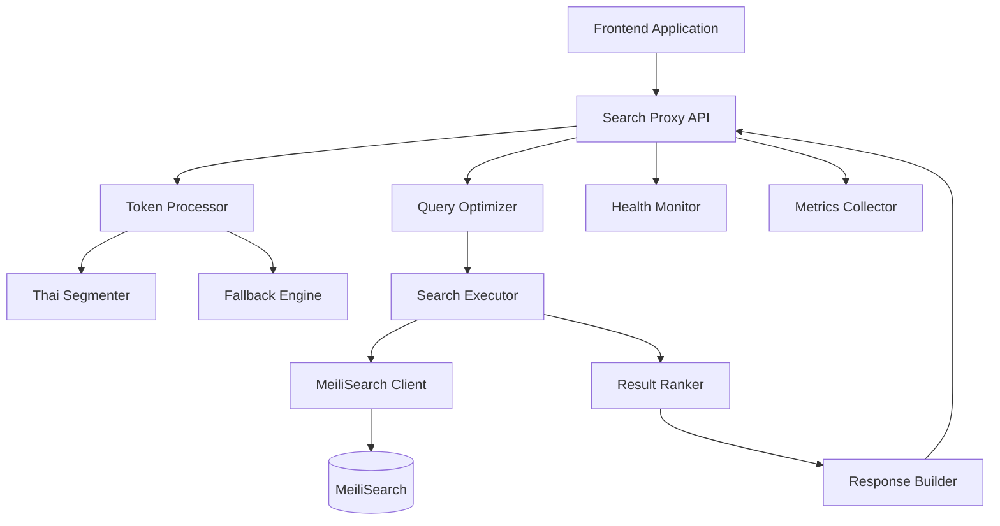

# Design Document

## Overview

The Thai Search Proxy Service is designed as an intelligent middleware layer that sits between frontend applications and Meilisearch, providing enhanced Thai language search capabilities through advanced tokenization and result ranking. The service leverages the existing Thai tokenization infrastructure while adding a new search proxy layer that optimizes search queries and results for Thai content.

The architecture follows a layered approach where the proxy service receives raw search queries, processes them through multiple tokenization strategies, performs parallel searches against Meilisearch with different query variants, and returns intelligently ranked results. This design ensures maximum search accuracy while maintaining high performance and reliability.

## Architecture

### High-Level Architecture



### Service Layers

1. **API Layer**: FastAPI-based REST endpoints for search requests
2. **Processing Layer**: Query tokenization and optimization
3. **Search Layer**: Parallel search execution against Meilisearch
4. **Ranking Layer**: Intelligent result scoring and ranking
5. **Integration Layer**: Meilisearch client and health monitoring

### Data Flow

1. Frontend sends raw Thai search query to proxy API
2. Query processor tokenizes the query using multiple strategies
3. Search executor performs parallel searches with original and tokenized queries
4. Result ranker scores and merges results from different search variants
5. Response builder formats the final ranked results
6. Metrics collector records performance and usage statistics

## Components and Interfaces

### Core Components

#### SearchProxyService
**Purpose**: Main orchestrator for search requests
**Responsibilities**:
- Coordinate the search pipeline from query to response
- Handle request validation and error management
- Manage concurrent search operations
- Collect and report metrics

```python
class SearchProxyService:
    async def search(
        self, 
        query: str, 
        options: SearchOptions
    ) -> SearchResponse
    
    async def batch_search(
        self, 
        queries: List[str], 
        options: SearchOptions
    ) -> List[SearchResponse]
```

#### QueryProcessor
**Purpose**: Process and optimize search queries for Thai content
**Responsibilities**:
- Generate multiple query variants using different tokenization strategies
- Handle mixed Thai-English content appropriately
- Optimize query structure for Meilisearch

```python
class QueryProcessor:
    async def process_query(
        self, 
        query: str
    ) -> ProcessedQuery
    
    def generate_query_variants(
        self, 
        tokenized_results: List[TokenizationResult]
    ) -> List[QueryVariant]
```

#### SearchExecutor
**Purpose**: Execute searches against Meilisearch with different query strategies
**Responsibilities**:
- Perform parallel searches with multiple query variants
- Handle Meilisearch connection and error management
- Collect raw search results from different approaches

```python
class SearchExecutor:
    async def execute_parallel_searches(
        self, 
        query_variants: List[QueryVariant], 
        index_name: str
    ) -> List[SearchResult]
    
    async def execute_single_search(
        self, 
        variant: QueryVariant, 
        index_name: str
    ) -> SearchResult
```

#### ResultRanker
**Purpose**: Rank and merge search results from multiple query variants
**Responsibilities**:
- Calculate relevance scores based on multiple factors
- Merge and deduplicate results from different searches
- Apply ranking algorithms optimized for Thai content

```python
class ResultRanker:
    def rank_results(
        self, 
        search_results: List[SearchResult], 
        original_query: str
    ) -> RankedResults
    
    def calculate_relevance_score(
        self, 
        result: SearchHit, 
        query_context: QueryContext
    ) -> float
```

### Data Models

#### SearchRequest
```python
class SearchRequest(BaseModel):
    query: str = Field(..., min_length=1, max_length=1000)
    index_name: str = Field(..., min_length=1)
    limit: int = Field(default=20, ge=1, le=100)
    offset: int = Field(default=0, ge=0)
    filters: Optional[Dict[str, Any]] = None
    sort: Optional[List[str]] = None
    highlight: bool = Field(default=True)
    include_tokenization_info: bool = Field(default=False)
```

#### SearchResponse
```python
class SearchResponse(BaseModel):
    hits: List[SearchHit]
    total_hits: int
    processing_time_ms: float
    query_info: QueryInfo
    pagination: PaginationInfo
    tokenization_info: Optional[TokenizationInfo] = None
```

#### ProcessedQuery
```python
class ProcessedQuery(BaseModel):
    original_query: str
    tokenization_results: List[TokenizationResult]
    query_variants: List[QueryVariant]
    processing_time_ms: float
    thai_content_detected: bool
    mixed_content: bool
```

#### QueryVariant
```python
class QueryVariant(BaseModel):
    query_text: str
    variant_type: QueryVariantType  # ORIGINAL, TOKENIZED, COMPOUND_SPLIT
    tokenization_engine: str
    weight: float  # For result ranking
    search_options: Dict[str, Any]
```

## Error Handling

### Error Categories

1. **Validation Errors**: Invalid input parameters, malformed queries
2. **Tokenization Errors**: Thai NLP processing failures
3. **Search Errors**: Meilisearch connectivity or query execution issues
4. **Ranking Errors**: Result processing and scoring failures
5. **System Errors**: Resource exhaustion, timeout issues

### Error Handling Strategy

#### Graceful Degradation
- If advanced tokenization fails, fall back to basic segmentation
- If parallel searches fail partially, return available results
- If ranking fails, return results in Meilisearch order
- If all tokenization fails, search with original query only

#### Error Response Format
```python
class SearchErrorResponse(BaseModel):
    error: str
    message: str
    details: Optional[Dict[str, Any]] = None
    fallback_used: bool = False
    partial_results: Optional[List[SearchHit]] = None
    timestamp: datetime
```

#### Retry Logic
- Implement exponential backoff for Meilisearch connection errors
- Retry failed tokenization with alternative engines
- Circuit breaker pattern for repeated failures
- Health check integration for dependency monitoring

## Testing Strategy

### Unit Testing

#### Component Testing
- **QueryProcessor**: Test tokenization with various Thai text samples
- **SearchExecutor**: Mock Meilisearch responses for different scenarios
- **ResultRanker**: Test ranking algorithms with known result sets
- **SearchProxyService**: Test orchestration and error handling

#### Thai Language Testing
- Formal Thai text (news articles, official documents)
- Informal Thai text (social media, chat messages)
- Mixed Thai-English content
- Compound words and technical terms
- Edge cases (empty queries, special characters)

### Integration Testing

#### End-to-End Search Flow
- Complete search pipeline from API request to response
- Multiple concurrent search requests
- Error scenarios and fallback behavior
- Performance under load conditions

#### Meilisearch Integration
- Index configuration and document management
- Search with different query types and filters
- Connection failure and recovery scenarios
- Task monitoring and completion verification

### Performance Testing

#### Benchmarks
- **Query Processing**: < 50ms for tokenization of 1000 Thai characters
- **Search Execution**: < 100ms for typical search requests
- **Result Ranking**: < 20ms for ranking 100 search results
- **End-to-End**: < 150ms for complete search pipeline

#### Load Testing
- Concurrent search requests (target: 500 requests/second)
- Memory usage under load (target: < 256MB per container)
- Connection pool efficiency with Meilisearch
- Graceful degradation under resource constraints

### Test Data Management

#### Thai Test Fixtures
- Curated Thai text samples in `data/samples/thai-search/`
- Known search queries with expected results
- Performance benchmark datasets
- Edge case scenarios and error conditions

#### Mock Services
- Meilisearch mock server for unit testing
- Configurable response scenarios
- Network failure simulation
- Performance characteristic simulation

## Configuration Management

### Environment-Based Configuration

#### Development Configuration
```yaml
# config/development/search-proxy.yaml
search_proxy:
  tokenization:
    primary_engine: "newmm"
    fallback_engines: ["attacut", "deepcut"]
    timeout_ms: 5000
  
  search:
    parallel_searches: true
    max_concurrent_searches: 5
    timeout_ms: 10000
  
  ranking:
    algorithm: "weighted_score"
    boost_exact_matches: 2.0
    boost_thai_matches: 1.5
```

#### Production Configuration
```yaml
# config/production/search-proxy.yaml
search_proxy:
  tokenization:
    primary_engine: "newmm"
    fallback_engines: ["attacut"]
    timeout_ms: 3000
  
  search:
    parallel_searches: true
    max_concurrent_searches: 10
    timeout_ms: 5000
  
  ranking:
    algorithm: "optimized_score"
    boost_exact_matches: 1.8
    boost_thai_matches: 1.3
```

### Runtime Configuration

#### Hot-Reload Capabilities
- Tokenization strategy changes without restart
- Ranking algorithm parameter updates
- Search timeout and concurrency adjustments
- Feature flag toggles for A/B testing

#### Configuration Validation
- Pydantic models for type safety and validation
- Environment variable override support
- Configuration file hierarchy (shared → environment → local)
- Startup validation with detailed error messages

## Monitoring and Observability

### Metrics Collection

#### Performance Metrics
- Query processing time by tokenization engine
- Search execution time by query variant type
- Result ranking time by algorithm
- End-to-end request processing time

#### Business Metrics
- Search query volume and patterns
- Thai vs. mixed content query distribution
- Tokenization engine usage and success rates
- Search result click-through rates (if available)

#### System Metrics
- Memory usage and garbage collection
- Connection pool utilization
- Error rates by category and component
- Health check status and response times

### Logging Strategy

#### Structured Logging
```python
# Search request logging
logger.info("Search request processed", extra={
    "query_length": len(query),
    "thai_content_ratio": 0.85,
    "tokenization_engine": "newmm",
    "search_variants": 3,
    "results_count": 42,
    "processing_time_ms": 87.5,
    "fallback_used": False
})
```

#### Log Levels and Content
- **DEBUG**: Detailed tokenization and ranking information
- **INFO**: Request/response summaries and performance metrics
- **WARNING**: Fallback usage and degraded performance
- **ERROR**: Component failures and error conditions

### Health Monitoring

#### Health Check Endpoints
- `/health`: Overall service health status
- `/health/detailed`: Component-level health information
- `/health/dependencies`: External dependency status
- `/metrics`: Prometheus-compatible metrics endpoint

#### Dependency Monitoring
- Meilisearch connectivity and response time
- Thai tokenization library availability
- Memory and CPU resource utilization
- Configuration file accessibility and validity