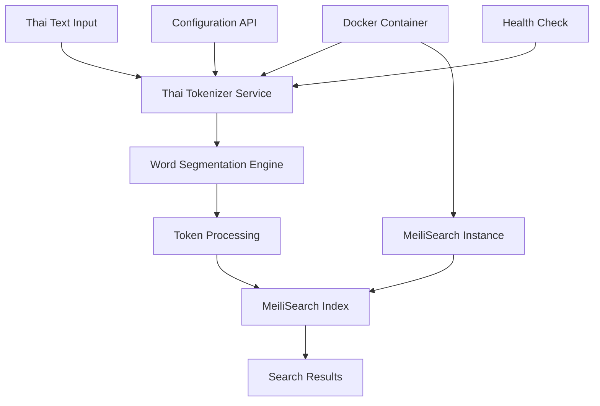

# Design Document

## Overview

This design addresses MeiliSearch's limitation with Thai compound word search by implementing a custom Thai tokenization solution. Thai language presents unique challenges as words are written without spaces, making compound word segmentation critical for accurate search results. The solution integrates a Thai word segmentation library with MeiliSearch through custom separator and non-separator token configurations, deployed as a containerized service.

## Architecture

### High-Level Architecture



### Component Integration

The solution consists of three main integration points:
1. **Pre-processing Pipeline**: Thai text is segmented before indexing
2. **MeiliSearch Configuration**: Custom separator tokens configured for Thai word boundaries
3. **Search Query Processing**: Query terms are segmented using the same tokenization logic

## Components and Interfaces

### 1. Thai Tokenizer Service

**Purpose**: Core service responsible for Thai word segmentation and MeiliSearch integration

**Key Components**:
- **Word Segmentation Engine**: Uses PyThaiNLP or similar library for accurate Thai word boundary detection
- **Token Processor**: Converts segmented words into MeiliSearch-compatible tokens
- **Configuration Manager**: Handles MeiliSearch settings updates for Thai tokenization

**API Endpoints**:
```
POST /tokenize
- Input: Thai text string
- Output: Array of segmented tokens

POST /index-document
- Input: Document with Thai content
- Output: Processed document with tokenized fields

GET /health
- Output: Service health status

PUT /config/meilisearch
- Input: MeiliSearch connection settings
- Output: Configuration status
```

### 2. MeiliSearch Integration Layer

**Custom Tokenization Strategy**:
- Configure custom separator tokens for Thai word boundaries
- Set non-separator tokens for preserving compound word components
- Implement dictionary-based tokenization for common Thai terms

**Settings Configuration**:
```json
{
  "separatorTokens": ["​", "​​"], // Thai word separators
  "nonSeparatorTokens": ["ๆ", "ฯ"], // Thai repetition marks
  "dictionary": ["compound_word_list"],
  "synonyms": {
    "variant_spellings": ["canonical_form"]
  }
}
```

### 3. Document Processing Pipeline

**Indexing Flow**:
1. Receive document with Thai content
2. Identify Thai text fields
3. Apply word segmentation to Thai content
4. Insert word boundaries as custom separators
5. Index processed document in MeiliSearch

**Search Flow**:
1. Receive search query with Thai terms
2. Segment query terms using same tokenization logic
3. Execute search with processed query
4. Return results with original Thai text

### 4. Container Orchestration

**Docker Services**:
- **Thai Tokenizer Service**: Python-based service with PyThaiNLP
- **MeiliSearch Instance**: Configured with Thai tokenization settings
- **Nginx Proxy**: Routes requests between services
- **Health Monitor**: Monitors service availability

## Data Models

### Document Structure

```typescript
interface ThaiDocument {
  id: string;
  title: string;
  content: string;
  thai_content?: string; // Original Thai text
  tokenized_content?: string; // Segmented version
  metadata: {
    language: string;
    tokenization_version: string;
    processed_at: string;
  };
}
```

### Tokenization Result

```typescript
interface TokenizationResult {
  original_text: string;
  tokens: string[];
  word_boundaries: number[];
  confidence_scores?: number[];
  processing_time_ms: number;
}
```

### Configuration Schema

```typescript
interface ThaiTokenizerConfig {
  meilisearch: {
    host: string;
    api_key: string;
    index_name: string;
  };
  tokenizer: {
    engine: 'pythainlp' | 'attacut' | 'deepcut';
    model_version: string;
    custom_dictionary?: string[];
  };
  processing: {
    batch_size: number;
    max_retries: number;
    timeout_ms: number;
  };
}
```

## Error Handling

### Tokenization Errors
- **Fallback Strategy**: Use character-level segmentation if word-level fails
- **Partial Processing**: Continue with successfully tokenized portions
- **Error Logging**: Detailed logs for debugging tokenization issues

### MeiliSearch Integration Errors
- **Connection Failures**: Retry with exponential backoff
- **Index Errors**: Validate document structure before indexing
- **Configuration Errors**: Validate settings before applying

### Container Health Management
- **Service Discovery**: Health checks for all components
- **Graceful Degradation**: Fallback to basic tokenization if advanced features fail
- **Recovery Procedures**: Automatic restart and state recovery

## Testing Strategy

### Unit Testing
- **Tokenization Accuracy**: Test with various Thai text patterns
- **Compound Word Handling**: Verify proper segmentation of complex terms
- **Edge Cases**: Handle mixed Thai-English content, special characters

### Integration Testing
- **MeiliSearch Integration**: Verify proper index configuration and search results
- **End-to-End Workflows**: Test complete document processing pipeline
- **Performance Testing**: Measure tokenization speed and search response times

### Container Testing
- **Service Orchestration**: Verify proper container startup and communication
- **Resource Usage**: Monitor memory and CPU consumption
- **Scalability**: Test with varying document volumes

### Sample Test Cases

```python
# Test compound word tokenization
test_cases = [
    {
        "input": "รถยนต์ไฟฟ้า",  # Electric car
        "expected": ["รถยนต์", "ไฟฟ้า"],
        "description": "Compound technical term"
    },
    {
        "input": "โรงเรียนมัธยมศึกษา",  # Secondary school
        "expected": ["โรงเรียน", "มัธยม", "ศึกษา"],
        "description": "Educational compound term"
    },
    {
        "input": "ความรับผิดชอบ",  # Responsibility
        "expected": ["ความ", "รับผิดชอบ"],
        "description": "Abstract concept compound"
    }
]
```

### Performance Benchmarks
- **Tokenization Speed**: < 100ms for 1000 characters
- **Search Response Time**: < 200ms for typical queries
- **Memory Usage**: < 512MB per container instance
- **Throughput**: > 100 documents/second indexing rate