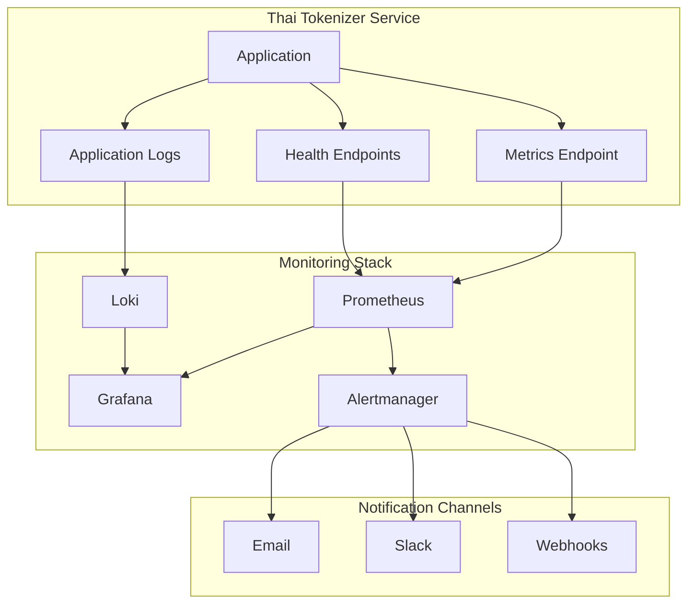

# Monitoring and Alerting Setup Guide

This guide provides comprehensive instructions for setting up monitoring and alerting systems for the Thai Tokenizer service across different deployment environments.

## Table of Contents

1. [Monitoring Architecture](#monitoring-architecture)
2. [Prometheus Setup](#prometheus-setup)
3. [Grafana Dashboard Configuration](#grafana-dashboard-configuration)
4. [Alerting Rules](#alerting-rules)
5. [Log Aggregation](#log-aggregation)
6. [Health Check Monitoring](#health-check-monitoring)
7. [Performance Monitoring](#performance-monitoring)
8. [Notification Channels](#notification-channels)
9. [Deployment-Specific Monitoring](#deployment-specific-monitoring)
10. [Troubleshooting Monitoring Issues](#troubleshooting-monitoring-issues)

## Monitoring Architecture

### Overview



### Monitoring Components

1. **Metrics Collection**: Prometheus for time-series metrics
2. **Visualization**: Grafana for dashboards and graphs
3. **Alerting**: Alertmanager for alert routing and notification
4. **Log Aggregation**: Loki for centralized log collection
5. **Health Monitoring**: Custom health check endpoints
6. **Performance Monitoring**: Application performance metrics

## Prometheus Setup

### Installation

```bash
# Create prometheus user
sudo useradd --no-create-home --shell /bin/false prometheus

# Create directories
sudo mkdir /etc/prometheus
sudo mkdir /var/lib/prometheus
sudo chown prometheus:prometheus /etc/prometheus
sudo chown prometheus:prometheus /var/lib/prometheus

# Download and install Prometheus
cd /tmp
wget https://github.com/prometheus/prometheus/releases/download/v2.40.0/prometheus-2.40.0.linux-amd64.tar.gz
tar xvf prometheus-2.40.0.linux-amd64.tar.gz
cd prometheus-2.40.0.linux-amd64

# Copy binaries
sudo cp prometheus /usr/local/bin/
sudo cp promtool /usr/local/bin/
sudo chown prometheus:prometheus /usr/local/bin/prometheus
sudo chown prometheus:prometheus /usr/local/bin/promtool

# Copy configuration files
sudo cp -r consoles /etc/prometheus
sudo cp -r console_libraries /etc/prometheus
sudo chown -R prometheus:prometheus /etc/prometheus/consoles
sudo chown -R prometheus:prometheus /etc/prometheus/console_libraries
```

### Configuration

```yaml
# /etc/prometheus/prometheus.yml
global:
  scrape_interval: 15s
  evaluation_interval: 15s

rule_files:
  - "thai_tokenizer_rules.yml"

alerting:
  alertmanagers:
    - static_configs:
        - targets:
          - localhost:9093

scrape_configs:
  - job_name: 'prometheus'
    static_configs:
      - targets: ['localhost:9090']

  - job_name: 'thai-tokenizer'
    static_configs:
      - targets: ['localhost:8000']
    metrics_path: '/metrics'
    scrape_interval: 10s
    scrape_timeout: 5s

  - job_name: 'thai-tokenizer-health'
    static_configs:
      - targets: ['localhost:8000']
    metrics_path: '/health/metrics'
    scrape_interval: 30s

  - job_name: 'meilisearch'
    static_configs:
      - targets: ['localhost:7700']
    metrics_path: '/metrics'
    scrape_interval: 30s
    bearer_token: 'YOUR_MEILISEARCH_API_KEY'

  - job_name: 'node-exporter'
    static_configs:
      - targets: ['localhost:9100']
```

### Systemd Service

```ini
# /etc/systemd/system/prometheus.service
[Unit]
Description=Prometheus
Wants=network-online.target
After=network-online.target

[Service]
User=prometheus
Group=prometheus
Type=simple
ExecStart=/usr/local/bin/prometheus \
    --config.file /etc/prometheus/prometheus.yml \
    --storage.tsdb.path /var/lib/prometheus/ \
    --web.console.templates=/etc/prometheus/consoles \
    --web.console.libraries=/etc/prometheus/console_libraries \
    --web.listen-address=0.0.0.0:9090 \
    --web.enable-lifecycle

[Install]
WantedBy=multi-user.target
```

### Thai Tokenizer Alerting Rules

```yaml
# /etc/prometheus/thai_tokenizer_rules.yml
groups:
  - name: thai_tokenizer_alerts
    rules:
      - alert: ThaiTokenizerDown
        expr: up{job="thai-tokenizer"} == 0
        for: 1m
        labels:
          severity: critical
        annotations:
          summary: "Thai Tokenizer service is down"
          description: "Thai Tokenizer service has been down for more than 1 minute"

      - alert: HighResponseTime
        expr: histogram_quantile(0.95, rate(http_request_duration_seconds_bucket{job="thai-tokenizer"}[5m])) > 0.1
        for: 5m
        labels:
          severity: warning
        annotations:
          summary: "High response time detected"
          description: "95th percentile response time is {{ $value }}s"

      - alert: HighErrorRate
        expr: rate(http_requests_total{job="thai-tokenizer",status=~"5.."}[5m]) / rate(http_requests_total{job="thai-tokenizer"}[5m]) > 0.05
        for: 5m
        labels:
          severity: warning
        annotations:
          summary: "High error rate detected"
          description: "Error rate is {{ $value | humanizePercentage }}"

      - alert: HighMemoryUsage
        expr: process_resident_memory_bytes{job="thai-tokenizer"} / 1024 / 1024 > 512
        for: 10m
        labels:
          severity: warning
        annotations:
          summary: "High memory usage"
          description: "Memory usage is {{ $value }}MB"

      - alert: MeilisearchConnectionFailed
        expr: thai_tokenizer_meilisearch_connection_status == 0
        for: 2m
        labels:
          severity: critical
        annotations:
          summary: "Meilisearch connection failed"
          description: "Cannot connect to Meilisearch server"

      - alert: SlowTokenization
        expr: histogram_quantile(0.95, rate(thai_tokenizer_tokenization_duration_seconds_bucket[5m])) > 0.05
        for: 5m
        labels:
          severity: warning
        annotations:
          summary: "Slow Thai tokenization"
          description: "95th percentile tokenization time is {{ $value }}s"
```

## Grafana Dashboard Configuration

### Installation

```bash
# Add Grafana repository
sudo apt-get install -y software-properties-common
sudo add-apt-repository "deb https://packages.grafana.com/oss/deb stable main"
wget -q -O - https://packages.grafana.com/gpg.key | sudo apt-key add -

# Install Grafana
sudo apt-get update
sudo apt-get install grafana

# Start and enable Grafana
sudo systemctl start grafana-server
sudo systemctl enable grafana-server
```

### Dashboard JSON Configuration

```json
{
  "dashboard": {
    "id": null,
    "title": "Thai Tokenizer Monitoring",
    "tags": ["thai-tokenizer", "monitoring"],
    "timezone": "browser",
    "panels": [
      {
        "id": 1,
        "title": "Service Status",
        "type": "stat",
        "targets": [
          {
            "expr": "up{job=\"thai-tokenizer\"}",
            "legendFormat": "Service Status"
          }
        ],
        "fieldConfig": {
          "defaults": {
            "mappings": [
              {
                "options": {
                  "0": {
                    "text": "DOWN",
                    "color": "red"
                  },
                  "1": {
                    "text": "UP",
                    "color": "green"
                  }
                }
              }
            ]
          }
        },
        "gridPos": {
          "h": 4,
          "w": 6,
          "x": 0,
          "y": 0
        }
      },
      {
        "id": 2,
        "title": "Request Rate",
        "type": "graph",
        "targets": [
          {
            "expr": "rate(http_requests_total{job=\"thai-tokenizer\"}[5m])",
            "legendFormat": "Requests/sec"
          }
        ],
        "yAxes": [
          {
            "label": "Requests/sec"
          }
        ],
        "gridPos": {
          "h": 8,
          "w": 12,
          "x": 0,
          "y": 4
        }
      },
      {
        "id": 3,
        "title": "Response Time",
        "type": "graph",
        "targets": [
          {
            "expr": "histogram_quantile(0.50, rate(http_request_duration_seconds_bucket{job=\"thai-tokenizer\"}[5m]))",
            "legendFormat": "50th percentile"
          },
          {
            "expr": "histogram_quantile(0.95, rate(http_request_duration_seconds_bucket{job=\"thai-tokenizer\"}[5m]))",
            "legendFormat": "95th percentile"
          },
          {
            "expr": "histogram_quantile(0.99, rate(http_request_duration_seconds_bucket{job=\"thai-tokenizer\"}[5m]))",
            "legendFormat": "99th percentile"
          }
        ],
        "yAxes": [
          {
            "label": "Seconds"
          }
        ],
        "gridPos": {
          "h": 8,
          "w": 12,
          "x": 12,
          "y": 4
        }
      },
      {
        "id": 4,
        "title": "Memory Usage",
        "type": "graph",
        "targets": [
          {
            "expr": "process_resident_memory_bytes{job=\"thai-tokenizer\"} / 1024 / 1024",
            "legendFormat": "Memory Usage (MB)"
          }
        ],
        "yAxes": [
          {
            "label": "MB"
          }
        ],
        "gridPos": {
          "h": 8,
          "w": 12,
          "x": 0,
          "y": 12
        }
      },
      {
        "id": 5,
        "title": "CPU Usage",
        "type": "graph",
        "targets": [
          {
            "expr": "rate(process_cpu_seconds_total{job=\"thai-tokenizer\"}[5m]) * 100",
            "legendFormat": "CPU Usage (%)"
          }
        ],
        "yAxes": [
          {
            "label": "Percent"
          }
        ],
        "gridPos": {
          "h": 8,
          "w": 12,
          "x": 12,
          "y": 12
        }
      },
      {
        "id": 6,
        "title": "Thai Tokenization Performance",
        "type": "graph",
        "targets": [
          {
            "expr": "histogram_quantile(0.95, rate(thai_tokenizer_tokenization_duration_seconds_bucket[5m]))",
            "legendFormat": "95th percentile tokenization time"
          }
        ],
        "yAxes": [
          {
            "label": "Seconds"
          }
        ],
        "gridPos": {
          "h": 8,
          "w": 12,
          "x": 0,
          "y": 20
        }
      },
      {
        "id": 7,
        "title": "Error Rate",
        "type": "graph",
        "targets": [
          {
            "expr": "rate(http_requests_total{job=\"thai-tokenizer\",status=~\"4..\"}[5m])",
            "legendFormat": "4xx errors/sec"
          },
          {
            "expr": "rate(http_requests_total{job=\"thai-tokenizer\",status=~\"5..\"}[5m])",
            "legendFormat": "5xx errors/sec"
          }
        ],
        "yAxes": [
          {
            "label": "Errors/sec"
          }
        ],
        "gridPos": {
          "h": 8,
          "w": 12,
          "x": 12,
          "y": 20
        }
      }
    ],
    "time": {
      "from": "now-1h",
      "to": "now"
    },
    "refresh": "30s"
  }
}
```

### Dashboard Import Script

```bash
#!/bin/bash
# import-dashboard.sh

GRAFANA_URL="http://localhost:3000"
GRAFANA_USER="admin"
GRAFANA_PASS="admin"

# Create dashboard
curl -X POST \
  -H "Content-Type: application/json" \
  -d @thai-tokenizer-dashboard.json \
  -u "$GRAFANA_USER:$GRAFANA_PASS" \
  "$GRAFANA_URL/api/dashboards/db"

echo "Dashboard imported successfully"
```

## Alerting Rules

### Alertmanager Configuration

```yaml
# /etc/alertmanager/alertmanager.yml
global:
  smtp_smarthost: 'localhost:587'
  smtp_from: 'alerts@company.com'

route:
  group_by: ['alertname']
  group_wait: 10s
  group_interval: 10s
  repeat_interval: 1h
  receiver: 'web.hook'
  routes:
    - match:
        severity: critical
      receiver: 'critical-alerts'
    - match:
        severity: warning
      receiver: 'warning-alerts'

receivers:
  - name: 'web.hook'
    webhook_configs:
      - url: 'http://localhost:5001/'

  - name: 'critical-alerts'
    email_configs:
      - to: 'admin@company.com'
        subject: 'CRITICAL: Thai Tokenizer Alert'
        body: |
          {{ range .Alerts }}
          Alert: {{ .Annotations.summary }}
          Description: {{ .Annotations.description }}
          {{ end }}
    slack_configs:
      - api_url: 'YOUR_SLACK_WEBHOOK_URL'
        channel: '#alerts'
        title: 'CRITICAL: Thai Tokenizer Alert'
        text: '{{ range .Alerts }}{{ .Annotations.summary }}{{ end }}'

  - name: 'warning-alerts'
    email_configs:
      - to: 'team@company.com'
        subject: 'WARNING: Thai Tokenizer Alert'
        body: |
          {{ range .Alerts }}
          Alert: {{ .Annotations.summary }}
          Description: {{ .Annotations.description }}
          {{ end }}

inhibit_rules:
  - source_match:
      severity: 'critical'
    target_match:
      severity: 'warning'
    equal: ['alertname', 'instance']
```

### Custom Alert Scripts

```python
#!/usr/bin/env python3
# custom-alert-handler.py

import json
import requests
import smtplib
from email.mime.text import MIMEText
from email.mime.multipart import MIMEMultipart
from flask import Flask, request

app = Flask(__name__)

class AlertHandler:
    def __init__(self):
        self.smtp_server = "localhost"
        self.smtp_port = 587
        self.email_user = "alerts@company.com"
        self.email_password = "password"
        self.slack_webhook = "YOUR_SLACK_WEBHOOK_URL"
    
    def send_email(self, to_email, subject, body):
        """Send email alert"""
        msg = MIMEMultipart()
        msg['From'] = self.email_user
        msg['To'] = to_email
        msg['Subject'] = subject
        
        msg.attach(MIMEText(body, 'plain'))
        
        try:
            server = smtplib.SMTP(self.smtp_server, self.smtp_port)
            server.starttls()
            server.login(self.email_user, self.email_password)
            text = msg.as_string()
            server.sendmail(self.email_user, to_email, text)
            server.quit()
            return True
        except Exception as e:
            print(f"Failed to send email: {e}")
            return False
    
    def send_slack(self, message):
        """Send Slack alert"""
        payload = {
            "text": message,
            "username": "Thai Tokenizer Alerts",
            "icon_emoji": ":warning:"
        }
        
        try:
            response = requests.post(self.slack_webhook, json=payload)
            return response.status_code == 200
        except Exception as e:
            print(f"Failed to send Slack message: {e}")
            return False
    
    def process_alert(self, alert_data):
        """Process incoming alert"""
        alerts = alert_data.get('alerts', [])
        
        for alert in alerts:
            alert_name = alert.get('labels', {}).get('alertname', 'Unknown')
            severity = alert.get('labels', {}).get('severity', 'unknown')
            summary = alert.get('annotations', {}).get('summary', 'No summary')
            description = alert.get('annotations', {}).get('description', 'No description')
            
            message = f"Alert: {alert_name}\nSeverity: {severity}\nSummary: {summary}\nDescription: {description}"
            
            # Send notifications based on severity
            if severity == 'critical':
                self.send_email('admin@company.com', f'CRITICAL: {alert_name}', message)
                self.send_slack(f":rotating_light: CRITICAL: {summary}")
            elif severity == 'warning':
                self.send_email('team@company.com', f'WARNING: {alert_name}', message)
                self.send_slack(f":warning: WARNING: {summary}")

alert_handler = AlertHandler()

@app.route('/', methods=['POST'])
def webhook():
    """Handle webhook alerts"""
    alert_data = request.json
    alert_handler.process_alert(alert_data)
    return 'OK', 200

if __name__ == '__main__':
    app.run(host='0.0.0.0', port=5001)
```

## Log Aggregation

### Loki Configuration

```yaml
# /etc/loki/loki.yml
auth_enabled: false

server:
  http_listen_port: 3100

ingester:
  lifecycler:
    address: 127.0.0.1
    ring:
      kvstore:
        store: inmemory
      replication_factor: 1
    final_sleep: 0s
  chunk_idle_period: 5m
  chunk_retain_period: 30s

schema_config:
  configs:
    - from: 2020-10-24
      store: boltdb
      object_store: filesystem
      schema: v11
      index:
        prefix: index_
        period: 168h

storage_config:
  boltdb:
    directory: /var/lib/loki/index

  filesystem:
    directory: /var/lib/loki/chunks

limits_config:
  enforce_metric_name: false
  reject_old_samples: true
  reject_old_samples_max_age: 168h

chunk_store_config:
  max_look_back_period: 0s

table_manager:
  retention_deletes_enabled: false
  retention_period: 0s
```

### Promtail Configuration

```yaml
# /etc/promtail/promtail.yml
server:
  http_listen_port: 9080
  grpc_listen_port: 0

positions:
  filename: /var/lib/promtail/positions.yaml

clients:
  - url: http://localhost:3100/loki/api/v1/push

scrape_configs:
  - job_name: thai-tokenizer
    static_configs:
      - targets:
          - localhost
        labels:
          job: thai-tokenizer
          __path__: /opt/thai-tokenizer/logs/*.log
    pipeline_stages:
      - json:
          expressions:
            timestamp: timestamp
            level: level
            message: message
            module: module
      - timestamp:
          source: timestamp
          format: RFC3339
      - labels:
          level:
          module:

  - job_name: systemd-journal
    journal:
      max_age: 12h
      labels:
        job: systemd-journal
    relabel_configs:
      - source_labels: ['__journal__systemd_unit']
        target_label: 'unit'
      - source_labels: ['__journal__hostname']
        target_label: 'hostname'
```

### Log Parsing Rules

```python
#!/usr/bin/env python3
# log-parser.py

import re
import json
from datetime import datetime

class ThaiTokenizerLogParser:
    def __init__(self):
        self.patterns = {
            'request': re.compile(r'(\d{4}-\d{2}-\d{2}T\d{2}:\d{2}:\d{2}) - (\w+) - Request: (\w+) (.+) - (\d+)ms'),
            'error': re.compile(r'(\d{4}-\d{2}-\d{2}T\d{2}:\d{2}:\d{2}) - ERROR - (.+)'),
            'tokenization': re.compile(r'(\d{4}-\d{2}-\d{2}T\d{2}:\d{2}:\d{2}) - INFO - Tokenization: (\d+) chars in (\d+)ms'),
            'memory': re.compile(r'(\d{4}-\d{2}-\d{2}T\d{2}:\d{2}:\d{2}) - INFO - Memory usage: (\d+)MB')
        }
    
    def parse_line(self, line):
        """Parse a single log line"""
        for log_type, pattern in self.patterns.items():
            match = pattern.match(line.strip())
            if match:
                return {
                    'type': log_type,
                    'timestamp': match.group(1),
                    'data': match.groups()[1:]
                }
        return None
    
    def parse_file(self, filename):
        """Parse entire log file"""
        parsed_logs = []
        with open(filename, 'r') as f:
            for line in f:
                parsed = self.parse_line(line)
                if parsed:
                    parsed_logs.append(parsed)
        return parsed_logs
    
    def generate_metrics(self, parsed_logs):
        """Generate metrics from parsed logs"""
        metrics = {
            'total_requests': 0,
            'error_count': 0,
            'avg_response_time': 0,
            'avg_tokenization_time': 0,
            'peak_memory': 0
        }
        
        response_times = []
        tokenization_times = []
        memory_values = []
        
        for log in parsed_logs:
            if log['type'] == 'request':
                metrics['total_requests'] += 1
                response_times.append(int(log['data'][3]))
            elif log['type'] == 'error':
                metrics['error_count'] += 1
            elif log['type'] == 'tokenization':
                tokenization_times.append(int(log['data'][2]))
            elif log['type'] == 'memory':
                memory_values.append(int(log['data'][1]))
        
        if response_times:
            metrics['avg_response_time'] = sum(response_times) / len(response_times)
        
        if tokenization_times:
            metrics['avg_tokenization_time'] = sum(tokenization_times) / len(tokenization_times)
        
        if memory_values:
            metrics['peak_memory'] = max(memory_values)
        
        return metrics

if __name__ == '__main__':
    parser = ThaiTokenizerLogParser()
    logs = parser.parse_file('/opt/thai-tokenizer/logs/thai-tokenizer.log')
    metrics = parser.generate_metrics(logs)
    print(json.dumps(metrics, indent=2))
```

## Health Check Monitoring

### Health Check Endpoint Implementation

```python
# Add to src/api/endpoints/health.py

from fastapi import APIRouter, HTTPException
from pydantic import BaseModel
import psutil
import time
import requests
from typing import Dict, Any

router = APIRouter()

class HealthStatus(BaseModel):
    status: str
    timestamp: str
    checks: Dict[str, Any]

class DetailedHealthStatus(BaseModel):
    status: str
    timestamp: str
    service: Dict[str, Any]
    dependencies: Dict[str, Any]
    resources: Dict[str, Any]
    performance: Dict[str, Any]

@router.get("/health", response_model=HealthStatus)
async def health_check():
    """Basic health check"""
    checks = {
        "service": "healthy",
        "meilisearch": await check_meilisearch(),
        "tokenization": await check_tokenization()
    }
    
    overall_status = "healthy" if all(
        status == "healthy" for status in checks.values()
    ) else "unhealthy"
    
    return HealthStatus(
        status=overall_status,
        timestamp=time.time(),
        checks=checks
    )

@router.get("/health/detailed", response_model=DetailedHealthStatus)
async def detailed_health_check():
    """Detailed health check with metrics"""
    service_info = {
        "status": "healthy",
        "uptime": time.time() - start_time,
        "version": "1.0.0"
    }
    
    dependencies = {
        "meilisearch": await check_meilisearch_detailed(),
        "python_version": f"{sys.version_info.major}.{sys.version_info.minor}",
        "pythainlp": await check_pythainlp()
    }
    
    resources = {
        "memory_usage_mb": psutil.Process().memory_info().rss / 1024 / 1024,
        "cpu_percent": psutil.Process().cpu_percent(),
        "disk_usage_percent": psutil.disk_usage('/').percent
    }
    
    performance = {
        "avg_response_time_ms": await get_avg_response_time(),
        "requests_per_second": await get_request_rate(),
        "error_rate_percent": await get_error_rate()
    }
    
    overall_status = "healthy"  # Determine based on checks
    
    return DetailedHealthStatus(
        status=overall_status,
        timestamp=time.time(),
        service=service_info,
        dependencies=dependencies,
        resources=resources,
        performance=performance
    )

async def check_meilisearch():
    """Check Meilisearch connectivity"""
    try:
        # Implementation depends on your Meilisearch client
        response = await meilisearch_client.health()
        return "healthy" if response.status == "available" else "unhealthy"
    except Exception:
        return "unhealthy"

async def check_tokenization():
    """Test Thai tokenization functionality"""
    try:
        from src.tokenizer.thai_segmenter import ThaiSegmenter
        segmenter = ThaiSegmenter()
        result = segmenter.tokenize("สวัสดี")
        return "healthy" if result else "unhealthy"
    except Exception:
        return "unhealthy"
```

### External Health Check Script

```bash
#!/bin/bash
# external-health-check.sh

SERVICE_URL="http://localhost:8000"
TIMEOUT=10
MAX_RETRIES=3

check_endpoint() {
    local endpoint=$1
    local expected_status=$2
    
    for i in $(seq 1 $MAX_RETRIES); do
        response=$(curl -s -w "%{http_code}" -m $TIMEOUT "$SERVICE_URL$endpoint")
        http_code="${response: -3}"
        
        if [ "$http_code" = "$expected_status" ]; then
            echo "✓ $endpoint - OK"
            return 0
        else
            echo "✗ $endpoint - Failed (HTTP $http_code) - Attempt $i/$MAX_RETRIES"
            sleep 2
        fi
    done
    
    return 1
}

echo "=== External Health Check - $(date) ==="

# Check basic health endpoint
if check_endpoint "/health" "200"; then
    HEALTH_OK=true
else
    HEALTH_OK=false
fi

# Check detailed health endpoint
if check_endpoint "/health/detailed" "200"; then
    DETAILED_OK=true
else
    DETAILED_OK=false
fi

# Check metrics endpoint
if check_endpoint "/metrics" "200"; then
    METRICS_OK=true
else
    METRICS_OK=false
fi

# Test tokenization endpoint
tokenization_response=$(curl -s -w "%{http_code}" -m $TIMEOUT \
    -X POST "$SERVICE_URL/tokenize" \
    -H "Content-Type: application/json" \
    -d '{"text": "สวัสดี"}')

tokenization_code="${tokenization_response: -3}"
if [ "$tokenization_code" = "200" ]; then
    echo "✓ /tokenize - OK"
    TOKENIZATION_OK=true
else
    echo "✗ /tokenize - Failed (HTTP $tokenization_code)"
    TOKENIZATION_OK=false
fi

# Overall status
if [ "$HEALTH_OK" = true ] && [ "$DETAILED_OK" = true ] && [ "$METRICS_OK" = true ] && [ "$TOKENIZATION_OK" = true ]; then
    echo "✓ Overall Status: HEALTHY"
    exit 0
else
    echo "✗ Overall Status: UNHEALTHY"
    exit 1
fi
```

## Performance Monitoring

### Custom Metrics Implementation

```python
# Add to src/utils/metrics.py

from prometheus_client import Counter, Histogram, Gauge, generate_latest
import time
import functools

# Define metrics
REQUEST_COUNT = Counter('http_requests_total', 'Total HTTP requests', ['method', 'endpoint', 'status'])
REQUEST_DURATION = Histogram('http_request_duration_seconds', 'HTTP request duration', ['method', 'endpoint'])
TOKENIZATION_DURATION = Histogram('thai_tokenizer_tokenization_duration_seconds', 'Thai tokenization duration')
MEMORY_USAGE = Gauge('process_memory_usage_bytes', 'Process memory usage in bytes')
MEILISEARCH_CONNECTION = Gauge('thai_tokenizer_meilisearch_connection_status', 'Meilisearch connection status')

def track_requests(func):
    """Decorator to track HTTP requests"""
    @functools.wraps(func)
    async def wrapper(*args, **kwargs):
        start_time = time.time()
        status = "200"
        
        try:
            result = await func(*args, **kwargs)
            return result
        except Exception as e:
            status = "500"
            raise
        finally:
            duration = time.time() - start_time
            REQUEST_COUNT.labels(method="POST", endpoint="/tokenize", status=status).inc()
            REQUEST_DURATION.labels(method="POST", endpoint="/tokenize").observe(duration)
    
    return wrapper

def track_tokenization(func):
    """Decorator to track tokenization performance"""
    @functools.wraps(func)
    def wrapper(*args, **kwargs):
        start_time = time.time()
        
        try:
            result = func(*args, **kwargs)
            return result
        finally:
            duration = time.time() - start_time
            TOKENIZATION_DURATION.observe(duration)
    
    return wrapper

def update_memory_usage():
    """Update memory usage metric"""
    import psutil
    process = psutil.Process()
    MEMORY_USAGE.set(process.memory_info().rss)

def update_meilisearch_status(status: bool):
    """Update Meilisearch connection status"""
    MEILISEARCH_CONNECTION.set(1 if status else 0)

def get_metrics():
    """Get all metrics in Prometheus format"""
    update_memory_usage()
    return generate_latest()
```

### Performance Monitoring Dashboard

```python
#!/usr/bin/env python3
# performance-dashboard.py

import time
import json
import requests
from datetime import datetime, timedelta
import matplotlib.pyplot as plt
import pandas as pd

class PerformanceDashboard:
    def __init__(self, service_url="http://localhost:8000", prometheus_url="http://localhost:9090"):
        self.service_url = service_url
        self.prometheus_url = prometheus_url
    
    def query_prometheus(self, query, start_time=None, end_time=None):
        """Query Prometheus for metrics"""
        params = {'query': query}
        
        if start_time and end_time:
            params.update({
                'start': start_time.isoformat(),
                'end': end_time.isoformat(),
                'step': '15s'
            })
            endpoint = '/api/v1/query_range'
        else:
            endpoint = '/api/v1/query'
        
        response = requests.get(f"{self.prometheus_url}{endpoint}", params=params)
        return response.json()
    
    def get_response_time_metrics(self, hours=1):
        """Get response time metrics for the last N hours"""
        end_time = datetime.now()
        start_time = end_time - timedelta(hours=hours)
        
        query = 'histogram_quantile(0.95, rate(http_request_duration_seconds_bucket{job="thai-tokenizer"}[5m]))'
        result = self.query_prometheus(query, start_time, end_time)
        
        return self.parse_time_series(result)
    
    def get_request_rate_metrics(self, hours=1):
        """Get request rate metrics"""
        end_time = datetime.now()
        start_time = end_time - timedelta(hours=hours)
        
        query = 'rate(http_requests_total{job="thai-tokenizer"}[5m])'
        result = self.query_prometheus(query, start_time, end_time)
        
        return self.parse_time_series(result)
    
    def get_error_rate_metrics(self, hours=1):
        """Get error rate metrics"""
        end_time = datetime.now()
        start_time = end_time - timedelta(hours=hours)
        
        query = 'rate(http_requests_total{job="thai-tokenizer",status=~"5.."}[5m]) / rate(http_requests_total{job="thai-tokenizer"}[5m])'
        result = self.query_prometheus(query, start_time, end_time)
        
        return self.parse_time_series(result)
    
    def parse_time_series(self, prometheus_result):
        """Parse Prometheus time series result"""
        if prometheus_result['status'] != 'success':
            return []
        
        data = []
        for result in prometheus_result['data']['result']:
            for timestamp, value in result['values']:
                data.append({
                    'timestamp': datetime.fromtimestamp(timestamp),
                    'value': float(value)
                })
        
        return data
    
    def generate_performance_report(self):
        """Generate comprehensive performance report"""
        report = {
            'timestamp': datetime.now().isoformat(),
            'response_time': self.get_response_time_metrics(24),
            'request_rate': self.get_request_rate_metrics(24),
            'error_rate': self.get_error_rate_metrics(24)
        }
        
        # Calculate summary statistics
        if report['response_time']:
            response_times = [item['value'] for item in report['response_time']]
            report['response_time_summary'] = {
                'avg': sum(response_times) / len(response_times),
                'max': max(response_times),
                'min': min(response_times)
            }
        
        return report
    
    def create_performance_charts(self):
        """Create performance visualization charts"""
        # Get data
        response_time_data = self.get_response_time_metrics(24)
        request_rate_data = self.get_request_rate_metrics(24)
        
        if not response_time_data or not request_rate_data:
            print("No data available for charts")
            return
        
        # Create DataFrame
        rt_df = pd.DataFrame(response_time_data)
        rr_df = pd.DataFrame(request_rate_data)
        
        # Create plots
        fig, (ax1, ax2) = plt.subplots(2, 1, figsize=(12, 8))
        
        # Response time plot
        ax1.plot(rt_df['timestamp'], rt_df['value'])
        ax1.set_title('Response Time (95th percentile)')
        ax1.set_ylabel('Seconds')
        ax1.grid(True)
        
        # Request rate plot
        ax2.plot(rr_df['timestamp'], rr_df['value'])
        ax2.set_title('Request Rate')
        ax2.set_ylabel('Requests/sec')
        ax2.set_xlabel('Time')
        ax2.grid(True)
        
        plt.tight_layout()
        plt.savefig('/tmp/performance-dashboard.png')
        print("Performance charts saved to /tmp/performance-dashboard.png")

if __name__ == '__main__':
    dashboard = PerformanceDashboard()
    report = dashboard.generate_performance_report()
    
    print(json.dumps(report, indent=2, default=str))
    dashboard.create_performance_charts()
```

This comprehensive monitoring and alerting setup guide provides detailed instructions for implementing a complete monitoring solution for the Thai Tokenizer service, including metrics collection, visualization, alerting, and performance monitoring across different deployment environments.