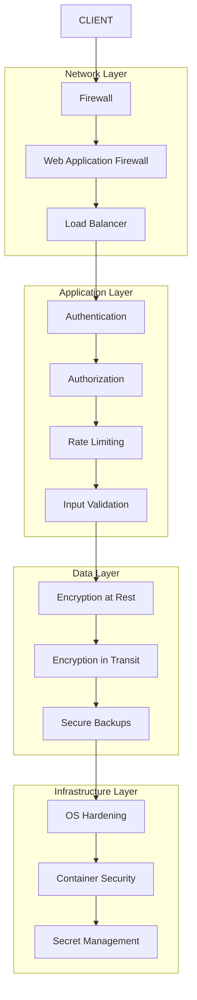

# Security Configuration and Best Practices Guide

This comprehensive guide provides detailed security configuration instructions and best practices for deploying and operating the Thai Tokenizer service in production environments.

## Table of Contents

1. [Security Architecture Overview](#security-architecture-overview)
2. [Network Security](#network-security)
3. [Authentication and Authorization](#authentication-and-authorization)
4. [Data Protection](#data-protection)
5. [System Security](#system-security)
6. [API Security](#api-security)
7. [Monitoring and Auditing](#monitoring-and-auditing)
8. [Compliance and Governance](#compliance-and-governance)
9. [Security Incident Response](#security-incident-response)
10. [Security Maintenance](#security-maintenance)

## Security Architecture Overview

### Security Layers



### Security Principles

1. **Defense in Depth**: Multiple layers of security controls
2. **Least Privilege**: Minimal access rights for users and processes
3. **Zero Trust**: Never trust, always verify
4. **Fail Secure**: Secure defaults and fail-safe mechanisms
5. **Security by Design**: Built-in security from the ground up

## Network Security

### Firewall Configuration

#### UFW (Ubuntu Firewall) Setup

```bash
#!/bin/bash
# firewall-setup.sh

echo "=== Configuring UFW Firewall ==="

# Reset UFW to defaults
sudo ufw --force reset

# Set default policies
sudo ufw default deny incoming
sudo ufw default allow outgoing

# Allow SSH (adjust port as needed)
sudo ufw allow 22/tcp comment 'SSH'

# Allow Thai Tokenizer service (internal only)
sudo ufw allow from 10.0.0.0/8 to any port 8000 comment 'Thai Tokenizer Internal'
sudo ufw allow from 172.16.0.0/12 to any port 8000 comment 'Thai Tokenizer Internal'
sudo ufw allow from 192.168.0.0/16 to any port 8000 comment 'Thai Tokenizer Internal'

# Allow HTTPS for external access (if using reverse proxy)
sudo ufw allow 443/tcp comment 'HTTPS'
sudo ufw allow 80/tcp comment 'HTTP (redirect to HTTPS)'

# Allow monitoring (restrict to monitoring servers)
sudo ufw allow from 10.0.1.100 to any port 9090 comment 'Prometheus'
sudo ufw allow from 10.0.1.100 to any port 3000 comment 'Grafana'

# Enable UFW
sudo ufw --force enable

# Show status
sudo ufw status verbose

echo "Firewall configuration completed"
```

#### iptables Rules

```bash
#!/bin/bash
# iptables-setup.sh

echo "=== Configuring iptables ==="

# Flush existing rules
iptables -F
iptables -X
iptables -t nat -F
iptables -t nat -X

# Set default policies
iptables -P INPUT DROP
iptables -P FORWARD DROP
iptables -P OUTPUT ACCEPT

# Allow loopback
iptables -A INPUT -i lo -j ACCEPT
iptables -A OUTPUT -o lo -j ACCEPT

# Allow established connections
iptables -A INPUT -m state --state ESTABLISHED,RELATED -j ACCEPT

# Allow SSH
iptables -A INPUT -p tcp --dport 22 -j ACCEPT

# Allow Thai Tokenizer service (internal networks only)
iptables -A INPUT -p tcp -s 10.0.0.0/8 --dport 8000 -j ACCEPT
iptables -A INPUT -p tcp -s 172.16.0.0/12 --dport 8000 -j ACCEPT
iptables -A INPUT -p tcp -s 192.168.0.0/16 --dport 8000 -j ACCEPT

# Allow HTTPS
iptables -A INPUT -p tcp --dport 443 -j ACCEPT
iptables -A INPUT -p tcp --dport 80 -j ACCEPT

# Rate limiting for HTTP/HTTPS
iptables -A INPUT -p tcp --dport 80 -m limit --limit 25/minute --limit-burst 100 -j ACCEPT
iptables -A INPUT -p tcp --dport 443 -m limit --limit 25/minute --limit-burst 100 -j ACCEPT

# Drop invalid packets
iptables -A INPUT -m state --state INVALID -j DROP

# Log dropped packets
iptables -A INPUT -j LOG --log-prefix "iptables-dropped: "

# Save rules
iptables-save > /etc/iptables/rules.v4

echo "iptables configuration completed"
```

### Network Segmentation

#### VLAN Configuration

```bash
# /etc/netplan/01-network-config.yaml
network:
  version: 2
  ethernets:
    eth0:
      dhcp4: false
  vlans:
    vlan.100:
      id: 100
      link: eth0
      addresses:
        - 10.100.1.10/24
      gateway4: 10.100.1.1
      nameservers:
        addresses:
          - 8.8.8.8
          - 8.8.4.4
      routes:
        - to: 10.200.0.0/16
          via: 10.100.1.1
```

### SSL/TLS Configuration

#### SSL Certificate Setup

```bash
#!/bin/bash
# ssl-setup.sh

SSL_DIR="/etc/ssl/thai-tokenizer"
DOMAIN="tokenizer.company.com"

echo "=== Setting up SSL certificates ==="

# Create SSL directory
sudo mkdir -p "$SSL_DIR"
sudo chmod 700 "$SSL_DIR"

# Generate private key
sudo openssl genrsa -out "$SSL_DIR/private.key" 4096
sudo chmod 600 "$SSL_DIR/private.key"

# Generate certificate signing request
sudo openssl req -new -key "$SSL_DIR/private.key" -out "$SSL_DIR/cert.csr" \
    -subj "/C=US/ST=State/L=City/O=Company/OU=IT/CN=$DOMAIN"

# Generate self-signed certificate (for testing)
sudo openssl x509 -req -days 365 -in "$SSL_DIR/cert.csr" \
    -signkey "$SSL_DIR/private.key" -out "$SSL_DIR/cert.crt"

# Set proper permissions
sudo chown -R root:ssl-cert "$SSL_DIR"
sudo chmod 644 "$SSL_DIR/cert.crt"
sudo chmod 644 "$SSL_DIR/cert.csr"

# Create certificate chain (if using CA-signed certificate)
# sudo cat "$SSL_DIR/cert.crt" intermediate.crt root.crt > "$SSL_DIR/fullchain.crt"

echo "SSL certificates configured"
echo "Certificate: $SSL_DIR/cert.crt"
echo "Private key: $SSL_DIR/private.key"
```

#### Nginx SSL Configuration

```nginx
# /etc/nginx/sites-available/thai-tokenizer-ssl
server {
    listen 80;
    server_name tokenizer.company.com;
    return 301 https://$server_name$request_uri;
}

server {
    listen 443 ssl http2;
    server_name tokenizer.company.com;

    # SSL Configuration
    ssl_certificate /etc/ssl/thai-tokenizer/cert.crt;
    ssl_certificate_key /etc/ssl/thai-tokenizer/private.key;
    
    # SSL Security Settings
    ssl_protocols TLSv1.2 TLSv1.3;
    ssl_ciphers ECDHE-RSA-AES256-GCM-SHA512:DHE-RSA-AES256-GCM-SHA512:ECDHE-RSA-AES256-GCM-SHA384:DHE-RSA-AES256-GCM-SHA384;
    ssl_prefer_server_ciphers off;
    ssl_session_cache shared:SSL:10m;
    ssl_session_timeout 10m;
    ssl_session_tickets off;
    
    # HSTS
    add_header Strict-Transport-Security "max-age=31536000; includeSubDomains" always;
    
    # Security Headers
    add_header X-Frame-Options DENY always;
    add_header X-Content-Type-Options nosniff always;
    add_header X-XSS-Protection "1; mode=block" always;
    add_header Referrer-Policy "strict-origin-when-cross-origin" always;
    add_header Content-Security-Policy "default-src 'self'; script-src 'self'; style-src 'self' 'unsafe-inline'; img-src 'self' data:; font-src 'self'; connect-src 'self'; frame-ancestors 'none';" always;

    # Rate Limiting
    limit_req_zone $binary_remote_addr zone=api:10m rate=10r/s;
    limit_req zone=api burst=20 nodelay;

    location / {
        proxy_pass http://127.0.0.1:8000;
        proxy_set_header Host $host;
        proxy_set_header X-Real-IP $remote_addr;
        proxy_set_header X-Forwarded-For $proxy_add_x_forwarded_for;
        proxy_set_header X-Forwarded-Proto $scheme;
        
        # Timeout settings
        proxy_connect_timeout 30s;
        proxy_send_timeout 30s;
        proxy_read_timeout 30s;
        
        # Buffer settings
        proxy_buffering on;
        proxy_buffer_size 4k;
        proxy_buffers 8 4k;
    }

    location /health {
        proxy_pass http://127.0.0.1:8000/health;
        access_log off;
    }

    # Block common attack patterns
    location ~* \.(php|asp|aspx|jsp)$ {
        return 444;
    }
    
    location ~* /\. {
        return 444;
    }
}
```

## Authentication and Authorization

### API Key Authentication

#### API Key Management System

```python
#!/usr/bin/env python3
# api-key-manager.py

import secrets
import hashlib
import json
import time
from datetime import datetime, timedelta
from pathlib import Path
from typing import Dict, List, Optional

class APIKeyManager:
    def __init__(self, config_file="/opt/thai-tokenizer/config/api-keys.json"):
        self.config_file = Path(config_file)
        self.config_file.parent.mkdir(exist_ok=True)
        self.keys = self._load_keys()
    
    def _load_keys(self) -> Dict:
        """Load API keys from configuration file"""
        if self.config_file.exists():
            with open(self.config_file, 'r') as f:
                return json.load(f)
        return {"keys": {}, "metadata": {"created": datetime.now().isoformat()}}
    
    def _save_keys(self):
        """Save API keys to configuration file"""
        with open(self.config_file, 'w') as f:
            json.dump(self.keys, f, indent=2)
        
        # Set restrictive permissions
        self.config_file.chmod(0o600)
    
    def _hash_key(self, key: str) -> str:
        """Hash API key for storage"""
        return hashlib.sha256(key.encode()).hexdigest()
    
    def generate_key(self, name: str, permissions: List[str] = None, 
                    expires_days: int = None) -> str:
        """Generate new API key"""
        # Generate secure random key
        key = f"tt_{secrets.token_urlsafe(32)}"
        key_hash = self._hash_key(key)
        
        # Set expiration
        expires_at = None
        if expires_days:
            expires_at = (datetime.now() + timedelta(days=expires_days)).isoformat()
        
        # Store key metadata
        self.keys["keys"][key_hash] = {
            "name": name,
            "permissions": permissions or ["tokenize", "health"],
            "created_at": datetime.now().isoformat(),
            "expires_at": expires_at,
            "last_used": None,
            "usage_count": 0,
            "active": True
        }
        
        self._save_keys()
        return key
    
    def validate_key(self, key: str, required_permission: str = None) -> bool:
        """Validate API key and check permissions"""
        key_hash = self._hash_key(key)
        
        if key_hash not in self.keys["keys"]:
            return False
        
        key_data = self.keys["keys"][key_hash]
        
        # Check if key is active
        if not key_data.get("active", True):
            return False
        
        # Check expiration
        if key_data.get("expires_at"):
            expires_at = datetime.fromisoformat(key_data["expires_at"])
            if datetime.now() > expires_at:
                return False
        
        # Check permissions
        if required_permission:
            permissions = key_data.get("permissions", [])
            if required_permission not in permissions and "admin" not in permissions:
                return False
        
        # Update usage statistics
        key_data["last_used"] = datetime.now().isoformat()
        key_data["usage_count"] = key_data.get("usage_count", 0) + 1
        self._save_keys()
        
        return True
    
    def revoke_key(self, key: str) -> bool:
        """Revoke API key"""
        key_hash = self._hash_key(key)
        
        if key_hash in self.keys["keys"]:
            self.keys["keys"][key_hash]["active"] = False
            self.keys["keys"][key_hash]["revoked_at"] = datetime.now().isoformat()
            self._save_keys()
            return True
        
        return False
    
    def list_keys(self) -> List[Dict]:
        """List all API keys (without revealing actual keys)"""
        keys_list = []
        for key_hash, key_data in self.keys["keys"].items():
            keys_list.append({
                "hash": key_hash[:16] + "...",
                "name": key_data["name"],
                "permissions": key_data["permissions"],
                "created_at": key_data["created_at"],
                "expires_at": key_data.get("expires_at"),
                "last_used": key_data.get("last_used"),
                "usage_count": key_data.get("usage_count", 0),
                "active": key_data.get("active", True)
            })
        
        return sorted(keys_list, key=lambda x: x["created_at"], reverse=True)
    
    def cleanup_expired_keys(self) -> int:
        """Remove expired keys"""
        removed_count = 0
        current_time = datetime.now()
        
        keys_to_remove = []
        for key_hash, key_data in self.keys["keys"].items():
            if key_data.get("expires_at"):
                expires_at = datetime.fromisoformat(key_data["expires_at"])
                if current_time > expires_at:
                    keys_to_remove.append(key_hash)
        
        for key_hash in keys_to_remove:
            del self.keys["keys"][key_hash]
            removed_count += 1
        
        if removed_count > 0:
            self._save_keys()
        
        return removed_count

# FastAPI Authentication Middleware
from fastapi import HTTPException, Security
from fastapi.security import HTTPBearer, HTTPAuthorizationCredentials

security = HTTPBearer()
api_key_manager = APIKeyManager()

async def verify_api_key(credentials: HTTPAuthorizationCredentials = Security(security)):
    """FastAPI dependency for API key verification"""
    if not credentials:
        raise HTTPException(status_code=401, detail="API key required")
    
    if not api_key_manager.validate_key(credentials.credentials, "tokenize"):
        raise HTTPException(status_code=401, detail="Invalid or expired API key")
    
    return credentials.credentials

if __name__ == "__main__":
    import sys
    
    manager = APIKeyManager()
    
    if len(sys.argv) < 2:
        print("Usage: python3 api-key-manager.py <generate|list|revoke|cleanup>")
        sys.exit(1)
    
    command = sys.argv[1]
    
    if command == "generate":
        name = input("Key name: ")
        permissions = input("Permissions (comma-separated, default: tokenize,health): ").strip()
        if not permissions:
            permissions = ["tokenize", "health"]
        else:
            permissions = [p.strip() for p in permissions.split(",")]
        
        expires_days = input("Expires in days (empty for no expiration): ").strip()
        expires_days = int(expires_days) if expires_days else None
        
        key = manager.generate_key(name, permissions, expires_days)
        print(f"Generated API key: {key}")
        print("Store this key securely - it cannot be retrieved again!")
    
    elif command == "list":
        keys = manager.list_keys()
        print("API Keys:")
        for key in keys:
            status = "Active" if key["active"] else "Revoked"
            print(f"  {key['hash']} - {key['name']} ({status})")
            print(f"    Permissions: {', '.join(key['permissions'])}")
            print(f"    Created: {key['created_at']}")
            print(f"    Last used: {key['last_used'] or 'Never'}")
            print(f"    Usage count: {key['usage_count']}")
            print()
    
    elif command == "revoke":
        key = input("Enter API key to revoke: ")
        if manager.revoke_key(key):
            print("API key revoked successfully")
        else:
            print("API key not found")
    
    elif command == "cleanup":
        removed = manager.cleanup_expired_keys()
        print(f"Removed {removed} expired keys")
    
    else:
        print(f"Unknown command: {command}")
        sys.exit(1)
```

### Role-Based Access Control (RBAC)

```python
# rbac.py - Role-Based Access Control

from enum import Enum
from typing import List, Dict, Set
from dataclasses import dataclass

class Permission(Enum):
    TOKENIZE = "tokenize"
    HEALTH_CHECK = "health"
    METRICS_VIEW = "metrics:view"
    CONFIG_READ = "config:read"
    CONFIG_WRITE = "config:write"
    ADMIN = "admin"

class Role(Enum):
    GUEST = "guest"
    USER = "user"
    OPERATOR = "operator"
    ADMIN = "admin"

@dataclass
class User:
    username: str
    roles: List[Role]
    api_key_hash: str
    active: bool = True

class RBACManager:
    def __init__(self):
        # Define role permissions
        self.role_permissions = {
            Role.GUEST: {Permission.HEALTH_CHECK},
            Role.USER: {Permission.TOKENIZE, Permission.HEALTH_CHECK},
            Role.OPERATOR: {
                Permission.TOKENIZE, Permission.HEALTH_CHECK, 
                Permission.METRICS_VIEW, Permission.CONFIG_READ
            },
            Role.ADMIN: {
                Permission.TOKENIZE, Permission.HEALTH_CHECK,
                Permission.METRICS_VIEW, Permission.CONFIG_READ,
                Permission.CONFIG_WRITE, Permission.ADMIN
            }
        }
        
        self.users: Dict[str, User] = {}
    
    def add_user(self, username: str, roles: List[Role], api_key_hash: str):
        """Add user with specified roles"""
        self.users[username] = User(username, roles, api_key_hash)
    
    def get_user_permissions(self, username: str) -> Set[Permission]:
        """Get all permissions for a user"""
        if username not in self.users:
            return set()
        
        user = self.users[username]
        if not user.active:
            return set()
        
        permissions = set()
        for role in user.roles:
            permissions.update(self.role_permissions.get(role, set()))
        
        return permissions
    
    def check_permission(self, username: str, permission: Permission) -> bool:
        """Check if user has specific permission"""
        user_permissions = self.get_user_permissions(username)
        return permission in user_permissions or Permission.ADMIN in user_permissions
    
    def require_permission(self, username: str, permission: Permission):
        """Raise exception if user doesn't have permission"""
        if not self.check_permission(username, permission):
            raise PermissionError(f"User {username} lacks permission: {permission.value}")

# FastAPI RBAC Middleware
from fastapi import Depends, HTTPException

rbac_manager = RBACManager()

def require_permission(permission: Permission):
    """FastAPI dependency factory for permission checking"""
    def permission_checker(api_key: str = Depends(verify_api_key)):
        # Get username from API key (implementation depends on your system)
        username = get_username_from_api_key(api_key)
        
        if not rbac_manager.check_permission(username, permission):
            raise HTTPException(
                status_code=403, 
                detail=f"Insufficient permissions: {permission.value} required"
            )
        
        return username
    
    return permission_checker

# Usage in FastAPI endpoints
@app.post("/tokenize")
async def tokenize_text(
    request: TokenizeRequest,
    username: str = Depends(require_permission(Permission.TOKENIZE))
):
    # Endpoint implementation
    pass
```

## Data Protection

### Encryption at Rest

```python
#!/usr/bin/env python3
# encryption-manager.py

import os
import json
from cryptography.fernet import Fernet
from cryptography.hazmat.primitives import hashes
from cryptography.hazmat.primitives.kdf.pbkdf2 import PBKDF2HMAC
import base64

class EncryptionManager:
    def __init__(self, password: str = None):
        self.password = password or os.environ.get('ENCRYPTION_PASSWORD')
        if not self.password:
            raise ValueError("Encryption password not provided")
        
        self.key = self._derive_key(self.password)
        self.cipher = Fernet(self.key)
    
    def _derive_key(self, password: str) -> bytes:
        """Derive encryption key from password"""
        # Use a fixed salt for consistency (in production, use random salt per file)
        salt = b'thai_tokenizer_salt_2024'
        kdf = PBKDF2HMAC(
            algorithm=hashes.SHA256(),
            length=32,
            salt=salt,
            iterations=100000,
        )
        key = base64.urlsafe_b64encode(kdf.derive(password.encode()))
        return key
    
    def encrypt_file(self, file_path: str, output_path: str = None):
        """Encrypt file"""
        output_path = output_path or f"{file_path}.encrypted"
        
        with open(file_path, 'rb') as f:
            data = f.read()
        
        encrypted_data = self.cipher.encrypt(data)
        
        with open(output_path, 'wb') as f:
            f.write(encrypted_data)
        
        # Set restrictive permissions
        os.chmod(output_path, 0o600)
        return output_path
    
    def decrypt_file(self, encrypted_file_path: str, output_path: str = None):
        """Decrypt file"""
        output_path = output_path or encrypted_file_path.replace('.encrypted', '')
        
        with open(encrypted_file_path, 'rb') as f:
            encrypted_data = f.read()
        
        decrypted_data = self.cipher.decrypt(encrypted_data)
        
        with open(output_path, 'wb') as f:
            f.write(decrypted_data)
        
        return output_path
    
    def encrypt_config(self, config_dict: dict) -> str:
        """Encrypt configuration dictionary"""
        config_json = json.dumps(config_dict)
        encrypted_config = self.cipher.encrypt(config_json.encode())
        return base64.urlsafe_b64encode(encrypted_config).decode()
    
    def decrypt_config(self, encrypted_config: str) -> dict:
        """Decrypt configuration dictionary"""
        encrypted_data = base64.urlsafe_b64decode(encrypted_config.encode())
        decrypted_json = self.cipher.decrypt(encrypted_data).decode()
        return json.loads(decrypted_json)

# Configuration encryption script
def encrypt_sensitive_configs():
    """Encrypt sensitive configuration files"""
    encryption_manager = EncryptionManager()
    
    sensitive_files = [
        "/opt/thai-tokenizer/config/config.json",
        "/opt/thai-tokenizer/config/api-keys.json",
        "/etc/thai-tokenizer/environment"
    ]
    
    for file_path in sensitive_files:
        if os.path.exists(file_path):
            encrypted_path = encryption_manager.encrypt_file(file_path)
            print(f"Encrypted: {file_path} -> {encrypted_path}")
            
            # Optionally remove original file
            # os.remove(file_path)

if __name__ == "__main__":
    encrypt_sensitive_configs()
```

### Secure Configuration Management

```python
# secure-config.py

import os
import json
from pathlib import Path
from typing import Any, Dict
from cryptography.fernet import Fernet

class SecureConfigManager:
    def __init__(self, config_dir: str = "/opt/thai-tokenizer/config"):
        self.config_dir = Path(config_dir)
        self.config_dir.mkdir(exist_ok=True)
        
        # Initialize encryption if password is available
        self.encryption_key = os.environ.get('CONFIG_ENCRYPTION_KEY')
        self.cipher = Fernet(self.encryption_key.encode()) if self.encryption_key else None
    
    def load_config(self, config_name: str) -> Dict[str, Any]:
        """Load configuration with automatic decryption"""
        config_file = self.config_dir / f"{config_name}.json"
        encrypted_file = self.config_dir / f"{config_name}.json.encrypted"
        
        # Try encrypted file first
        if encrypted_file.exists() and self.cipher:
            with open(encrypted_file, 'rb') as f:
                encrypted_data = f.read()
            
            decrypted_data = self.cipher.decrypt(encrypted_data)
            return json.loads(decrypted_data.decode())
        
        # Fall back to plain text file
        elif config_file.exists():
            with open(config_file, 'r') as f:
                return json.load(f)
        
        else:
            raise FileNotFoundError(f"Configuration file not found: {config_name}")
    
    def save_config(self, config_name: str, config_data: Dict[str, Any], encrypt: bool = True):
        """Save configuration with optional encryption"""
        config_json = json.dumps(config_data, indent=2)
        
        if encrypt and self.cipher:
            # Save encrypted version
            encrypted_file = self.config_dir / f"{config_name}.json.encrypted"
            encrypted_data = self.cipher.encrypt(config_json.encode())
            
            with open(encrypted_file, 'wb') as f:
                f.write(encrypted_data)
            
            # Set restrictive permissions
            encrypted_file.chmod(0o600)
            
            # Remove plain text version if it exists
            plain_file = self.config_dir / f"{config_name}.json"
            if plain_file.exists():
                plain_file.unlink()
        
        else:
            # Save plain text version
            config_file = self.config_dir / f"{config_name}.json"
            with open(config_file, 'w') as f:
                f.write(config_json)
            
            config_file.chmod(0o600)
    
    def mask_sensitive_values(self, config: Dict[str, Any]) -> Dict[str, Any]:
        """Mask sensitive values in configuration for logging"""
        sensitive_keys = {
            'api_key', 'password', 'secret', 'token', 'key', 'credential'
        }
        
        masked_config = {}
        for key, value in config.items():
            if isinstance(value, dict):
                masked_config[key] = self.mask_sensitive_values(value)
            elif any(sensitive_key in key.lower() for sensitive_key in sensitive_keys):
                if isinstance(value, str) and len(value) > 8:
                    masked_config[key] = value[:4] + '*' * (len(value) - 8) + value[-4:]
                else:
                    masked_config[key] = '***'
            else:
                masked_config[key] = value
        
        return masked_config

# Environment variable security
class SecureEnvironment:
    @staticmethod
    def load_secure_env(env_file: str = "/opt/thai-tokenizer/config/.env.encrypted"):
        """Load encrypted environment variables"""
        if not os.path.exists(env_file):
            return
        
        encryption_key = os.environ.get('ENV_ENCRYPTION_KEY')
        if not encryption_key:
            raise ValueError("ENV_ENCRYPTION_KEY not set")
        
        cipher = Fernet(encryption_key.encode())
        
        with open(env_file, 'rb') as f:
            encrypted_data = f.read()
        
        decrypted_data = cipher.decrypt(encrypted_data).decode()
        
        for line in decrypted_data.split('\n'):
            line = line.strip()
            if line and not line.startswith('#'):
                key, value = line.split('=', 1)
                os.environ[key] = value
    
    @staticmethod
    def create_secure_env(env_vars: Dict[str, str], output_file: str):
        """Create encrypted environment file"""
        encryption_key = os.environ.get('ENV_ENCRYPTION_KEY')
        if not encryption_key:
            raise ValueError("ENV_ENCRYPTION_KEY not set")
        
        cipher = Fernet(encryption_key.encode())
        
        env_content = '\n'.join(f"{key}={value}" for key, value in env_vars.items())
        encrypted_data = cipher.encrypt(env_content.encode())
        
        with open(output_file, 'wb') as f:
            f.write(encrypted_data)
        
        os.chmod(output_file, 0o600)
```

## System Security

### OS Hardening

```bash
#!/bin/bash
# os-hardening.sh

echo "=== OS Hardening for Thai Tokenizer ==="

# Update system packages
echo "Updating system packages..."
apt update && apt upgrade -y

# Install security tools
apt install -y fail2ban ufw rkhunter chkrootkit aide

# Configure automatic security updates
echo "Configuring automatic security updates..."
cat > /etc/apt/apt.conf.d/20auto-upgrades << 'EOF'
APT::Periodic::Update-Package-Lists "1";
APT::Periodic::Unattended-Upgrade "1";
APT::Periodic::AutocleanInterval "7";
EOF

# Disable unnecessary services
echo "Disabling unnecessary services..."
systemctl disable bluetooth
systemctl disable cups
systemctl disable avahi-daemon
systemctl stop bluetooth
systemctl stop cups
systemctl stop avahi-daemon

# Configure SSH security
echo "Hardening SSH configuration..."
cp /etc/ssh/sshd_config /etc/ssh/sshd_config.backup

cat > /etc/ssh/sshd_config << 'EOF'
# SSH Security Configuration
Port 22
Protocol 2
HostKey /etc/ssh/ssh_host_rsa_key
HostKey /etc/ssh/ssh_host_ecdsa_key
HostKey /etc/ssh/ssh_host_ed25519_key

# Authentication
LoginGraceTime 60
PermitRootLogin no
StrictModes yes
MaxAuthTries 3
MaxSessions 2
PubkeyAuthentication yes
PasswordAuthentication no
PermitEmptyPasswords no
ChallengeResponseAuthentication no
UsePAM yes

# Security settings
X11Forwarding no
PrintMotd no
TCPKeepAlive yes
Compression delayed
ClientAliveInterval 300
ClientAliveCountMax 2
AllowUsers thai-tokenizer
DenyUsers root

# Logging
SyslogFacility AUTH
LogLevel INFO
EOF

systemctl restart sshd

# Configure fail2ban
echo "Configuring fail2ban..."
cat > /etc/fail2ban/jail.local << 'EOF'
[DEFAULT]
bantime = 3600
findtime = 600
maxretry = 3
backend = systemd

[sshd]
enabled = true
port = ssh
filter = sshd
logpath = /var/log/auth.log
maxretry = 3

[nginx-http-auth]
enabled = true
filter = nginx-http-auth
port = http,https
logpath = /var/log/nginx/error.log

[nginx-limit-req]
enabled = true
filter = nginx-limit-req
port = http,https
logpath = /var/log/nginx/error.log
maxretry = 10
EOF

systemctl enable fail2ban
systemctl start fail2ban

# Set file permissions
echo "Setting secure file permissions..."
chmod 700 /opt/thai-tokenizer
chmod 600 /opt/thai-tokenizer/config/*
chmod 755 /opt/thai-tokenizer/bin/*
chmod 644 /opt/thai-tokenizer/logs/*

# Configure system limits
echo "Configuring system limits..."
cat > /etc/security/limits.d/thai-tokenizer.conf << 'EOF'
thai-tokenizer soft nofile 65536
thai-tokenizer hard nofile 65536
thai-tokenizer soft nproc 4096
thai-tokenizer hard nproc 4096
EOF

# Kernel security parameters
echo "Configuring kernel security parameters..."
cat > /etc/sysctl.d/99-security.conf << 'EOF'
# Network security
net.ipv4.ip_forward = 0
net.ipv4.conf.all.send_redirects = 0
net.ipv4.conf.default.send_redirects = 0
net.ipv4.conf.all.accept_redirects = 0
net.ipv4.conf.default.accept_redirects = 0
net.ipv4.conf.all.accept_source_route = 0
net.ipv4.conf.default.accept_source_route = 0
net.ipv4.conf.all.log_martians = 1
net.ipv4.conf.default.log_martians = 1
net.ipv4.icmp_echo_ignore_broadcasts = 1
net.ipv4.icmp_ignore_bogus_error_responses = 1
net.ipv4.tcp_syncookies = 1

# Memory protection
kernel.dmesg_restrict = 1
kernel.kptr_restrict = 2
kernel.yama.ptrace_scope = 1
EOF

sysctl -p /etc/sysctl.d/99-security.conf

# Configure log rotation
echo "Configuring log rotation..."
cat > /etc/logrotate.d/thai-tokenizer << 'EOF'
/opt/thai-tokenizer/logs/*.log {
    daily
    missingok
    rotate 30
    compress
    delaycompress
    notifempty
    create 644 thai-tokenizer thai-tokenizer
    postrotate
        systemctl reload thai-tokenizer > /dev/null 2>&1 || true
    endscript
}
EOF

# Install and configure AIDE (file integrity monitoring)
echo "Configuring AIDE..."
aideinit
mv /var/lib/aide/aide.db.new /var/lib/aide/aide.db

# Create daily AIDE check
cat > /etc/cron.daily/aide-check << 'EOF'
#!/bin/bash
aide --check | mail -s "AIDE Report $(hostname)" admin@company.com
EOF
chmod +x /etc/cron.daily/aide-check

echo "OS hardening completed successfully"
```

### Container Security (Docker)

```dockerfile
# Secure Dockerfile
FROM python:3.12-slim as builder

# Create non-root user
RUN groupadd -r thai-tokenizer && useradd -r -g thai-tokenizer thai-tokenizer

# Install security updates
RUN apt-get update && apt-get upgrade -y && \
    apt-get install -y --no-install-recommends \
    build-essential \
    && rm -rf /var/lib/apt/lists/*

# Install Python dependencies
WORKDIR /app
COPY requirements.txt .
RUN pip install --no-cache-dir --user -r requirements.txt

# Production stage
FROM python:3.12-slim

# Install security updates
RUN apt-get update && apt-get upgrade -y && \
    apt-get install -y --no-install-recommends \
    ca-certificates \
    && rm -rf /var/lib/apt/lists/*

# Create non-root user
RUN groupadd -r thai-tokenizer && useradd -r -g thai-tokenizer thai-tokenizer

# Copy Python dependencies
COPY --from=builder /root/.local /home/thai-tokenizer/.local

# Copy application
WORKDIR /app
COPY --chown=thai-tokenizer:thai-tokenizer . .

# Set secure permissions
RUN chmod -R 755 /app && \
    chmod -R 644 /app/src && \
    chmod 755 /app/src/api/main.py

# Security settings
USER thai-tokenizer
EXPOSE 8000

# Health check
HEALTHCHECK --interval=30s --timeout=10s --start-period=5s --retries=3 \
    CMD curl -f http://localhost:8000/health || exit 1

# Run application
CMD ["python", "-m", "src.api.main"]
```

```yaml
# docker-compose-secure.yml
version: '3.8'

services:
  thai-tokenizer:
    build: .
    container_name: thai-tokenizer
    restart: unless-stopped
    
    # Security settings
    user: "1000:1000"
    read_only: true
    cap_drop:
      - ALL
    cap_add:
      - NET_BIND_SERVICE
    security_opt:
      - no-new-privileges:true
      - apparmor:docker-default
    
    # Resource limits
    deploy:
      resources:
        limits:
          cpus: '1.0'
          memory: 512M
        reservations:
          cpus: '0.5'
          memory: 256M
    
    # Network security
    networks:
      - thai-tokenizer-network
    
    # Volumes (read-only where possible)
    volumes:
      - ./config:/app/config:ro
      - thai-tokenizer-logs:/app/logs
      - thai-tokenizer-tmp:/tmp
    
    # Environment variables
    environment:
      - PYTHONUNBUFFERED=1
      - PYTHONDONTWRITEBYTECODE=1
    
    # Health check
    healthcheck:
      test: ["CMD", "curl", "-f", "http://localhost:8000/health"]
      interval: 30s
      timeout: 10s
      retries: 3
      start_period: 40s

networks:
  thai-tokenizer-network:
    driver: bridge
    ipam:
      config:
        - subnet: 172.20.0.0/16

volumes:
  thai-tokenizer-logs:
  thai-tokenizer-tmp:
```

This comprehensive security configuration guide provides detailed instructions for implementing robust security measures across all aspects of the Thai Tokenizer service deployment, ensuring protection against common threats and compliance with security best practices.